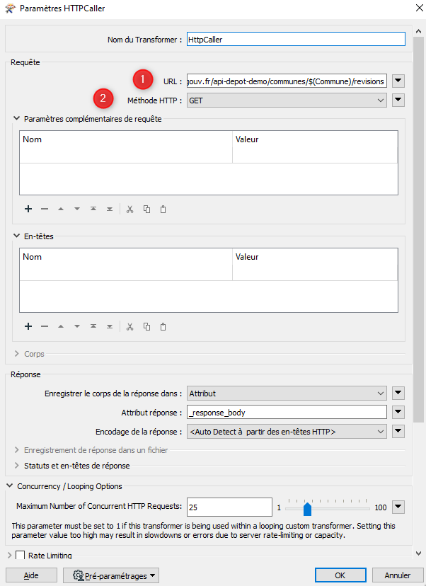

# Paramétrage de l'API BAL pour FME #

## Principe

L'alimentation de la BaseAdresseLocale évolue et permet à présent de téléverser les fichiers communaux au format BAL via une API. L'Agglomération de la Région de Compiègne, signataire de la [charte "Base Adresse Locale"](https://geo.compiegnois.fr/portail/index.php/2021/05/30/adresse-le-compiegnois-sur-la-bonne-voie/), diffuse quotidiennement les informations certifiées des communes du Pays Compiégnois. 

Le service SIG qui utilise déjà l'ETL FME de la société "Safe Software" pour l'ensemble de ces traitements, a paramétré un projet pour utiliser cette API.

Contact : sig@agglo-compiegne.fr

## Changelog

 * 21/09/2021 : Version 1 - téléversement d'un fichier ou d'un lot de données communal au format BAL 1.2 dans l'API BAL
 
## Gabarit

- [Téléchargement du projet FME - traitement par lot](https://geo.compiegnois.fr/documents/metiers/rva/API_BAL_LOT_FME_v1.zip)

## Paramétrage

Cette première version est une version béta permettant le téléversement soit d'un seul fichier BAL commune à la fois, soit d'un téléversement en masse de x communes. La version de FME utilisée est la 2021.1.1.0.

Les paramètres passés dans le traitement sont tous issus de la [documentation de l'API BAL de la BaseAdresseNationale](https://github.com/etalab/ban-api-depot/wiki/Documentation).

#### 1 - Création du fichier de configuration

Afin de téléverser un lot de communes dans l'API BAL, nous avons choisi de créer un fichier Excel contenant la liste des communes à téléverser. Ce fichier est à intégrer comme données sources au début du traitement. Ce fichier peut contenir 1 ou plusieurs communes.

Exemple de structuration du fichier Excel de configuration :

|insee|commune|jeton|
|:---|:---|:---|
|60159|Compiègne|[jeton fournit par la BAL]|
|60325|Jaux|[jeton fournit par la BAL]|

**ATTENTION** : si vous utilisez une autre clé pour la référence de vos communes comme le code SIREN, qui est également référencé dans vos fichiers BAL de commune, vous devez remplacer l'attribut insee par siren. Ce remplacement devra être réalisé également dans les paramètres du traitement.

### 2 - Création de la chaîne de traitement

#### 2.1 - Insérer le fichier de conf comme `Données sources`

Ensuite sélectionner le format Excel et indiquer le lieu de votre fichier.

Votre fichier de configuration est en début de chaîne.
 
#### 2.2 - Paramétrer un HttpCaller pour lancer la 1er requête nommée `REVISION`
 
 
 
 
 
 Paramètres à indiquer dans ce transformer :
 
 https://plateforme.adresse.data.gouv.fr/api-depot-demo/communes/@Value(insee)/revisions

L'attribut `@Value(insee)` correspond au code insee de la commune à téléverser et présent dans le fichier de conf.

 **POST**

 Nom **Authorization:** et Valeur **Token @Value(jeton)**

L'attribut `@Value(jeton)` correspond au jeton contenant la clé fournie par la BAL et indiqué dans le fichier de conf pour chaque commune (ici nous saisirons donc la clé de démonstration dans un premier temps).
 
  **Specify Upload Body**
 
  (ouvrir l'éditeur de texte et copier le code ci-dessous)
 
 `{
  "context": {
    "nomComplet": "[votre nom]",
    "organisation": "[organisme]", 
    "extras": {
      "internal_id": ""
    }
  }
}`

  **JSON (application/json)**
 
 Laisser les autres paramètres par défaut. L'attribut de réponse `_response_body` sera utilisé dans la suite du traitement et correspond au code de retour de l'API.
 
#### 2.3 - Récupération de l'attribut `_ID` dans la requête de réponse de `REVISION` pour lancer la 2nd requête nommée `TELEVERSEMENT`
  
La réponse de l'API s'effectue au format JSON, il faut donc récupérer les différents attributs utiles pour la suite du traitement et notamment l'`_ID`.

 - Extraction des attributs JSON avec le transformer `JSONFragmenter`

 
 
  Paramètres à indiquer dans ce transformer :
 
 
 
  **Attribut JSON**
 
  **_response_body**
 
  **json[*]**
 
  **JSON**
 
  - Conserver uniquement l'attribut `_ID` avec un simple transformer `Tester`

 
 
 L'attribut `json_index` liste l'ensemble des attributs de la requête de réponse. Il suffit de filter avec le nom `_id` pour récupérer en sortie uniquement la valeur de celui-ci dans l'attribut `_response_body`.

#### 2.4 - Paramétrer un HttpCaller pour lancer la 2nd requête nommée `TELEVERSEMENT`
 

 
 Paramètres à indiquer dans ce transformer :
 
 https://plateforme.adresse.data.gouv.fr/api-depot-demo/revisions/@Value(_response_body)/files/bal

L'attribut `@Value(_response_body)` contient la valeur de l'ID récupérée précédemment et à passer dans cette requête.

 **PUT**

 Nom **Content-MD5:** et Valeur  **1234567890abcdedf1234567890abcdedf**

L'attribut de la taille en octet du fichier n'a pas été intégré dans ce traitement (optionnel dans l'API).

 Nom **Authorization:** et Valeur **Token @Value(jeton)**

L'attribut `@Value(jeton)` correspond au jeton contenant la clé fournie par la BAL et indiqué dans le fichier de conf pour chaque commune (ici nous saisirons donc la clé de démonstration dans un premier temps).
 
  **Envoyer à partir d'un fichier**
 
  (indiquer le chemin de votre fichier BAL au format csv). Dans le chemin d'accès au fichier vous devez intégrer le code insee présent dans le fichier de conf `@Value(insee)` car vos fichiers doivent contenir ce code (ex: `c:\temp\@Value(insee)_bal.csv`)

  **text/csv**
 
 Laisser les autres paramètres par défaut. L'attribut de réponse `_response_body` sera utilisé dans la suite du traitement et correspond au code de retour de l'API.

#### 2.5 - Récupération de l'attribut `revisionId` dans la requête de réponse de `TELEVERSEMENT` pour lancer la 3ème requête nommée `VALIDATION`
  
La réponse de l'API s'effectue au format JSON, il faut donc récupérer les différents attributs utiles pour la suite du traitement et notamment `revisionId`.

 - Extraction des attributs JSON avec le transformer `JSONFragmenter`

Reprendre la méthode indiquée au point **3**.
 
  - Conserver uniquement l'attribut `revisionId` avec un simple transformer `Tester`
 
Reprendre la méthode indiquée au point **3**.

 L'attribut `json_index` liste l'ensemble des attributs de la requête de réponse. Il suffit de filter avec le nom `revisionId` pour récupérer en sortie uniquement la valeur de celui-ci dans l'attribut `_response_body`.

#### 2.6 - Paramétrer un HttpCaller pour lancer la 3ème requête nommée `VALIDATION`
 

 
 Paramètres à indiquer dans ce transformer :
 
 https://plateforme.adresse.data.gouv.fr/api-depot-demo/revisions/@Value(_response_body)/compute

L'attribut `@Value(_response_body)` contient la valeur de l'ID récupérée précédemment et à passer dans cette requête.

 **POST**

 Nom **Authorization:** et Valeur **Token @Value(jeton)**

L'attribut `@Value(jeton)` correspond au jeton contenant la clé fournie par la BAL et indiqué dans le fichier de conf pour chaque commune (ici nous saisirons donc la clé de démonstration dans un premier temps).
 
  Les paramètres de la précédente requête peuvent être gardée par défaut (pas d'incidence sur la requête)
 
Laisser les autres paramètres par défaut. L'attribut de réponse `_response_body` sera utilisé dans la suite du traitement et correspond au code de retour de l'API.

#### 2.7 - Récupération de l'attribut `_id` dans la requête de réponse de `VALIDATION` pour lancer la 4ème requête nommée `PUBLICATION`
  
La réponse de l'API s'effectue au format JSON, il faut donc récupérer les différents attributs utiles pour la suite du traitement et notamment l'`_id`.

 - Extraction des attributs JSON avec le transformer `JSONFragmenter`

Reprendre la méthode indiquée au point **3**.
 
  - Conserver uniquement l'attribut `revisionId` avec un simple transformer `Tester`
 
Reprendre la méthode indiquée au point **3**.

 L'attribut `json_index` liste l'ensemble des attributs de la requête de réponse. Il suffit de filter avec le nom `_id` pour récupérer en sortie uniquement la valeur de celui-ci dans l'attribut `_response_body`.

#### 2.8 - Paramétrer un HttpCaller pour lancer la 4ème requête nommée `PUBLICATION`
 

 
 Paramètres à indiquer dans ce transformer :
 
 https://plateforme.adresse.data.gouv.fr/api-depot-demo/revisions/@Value(_response_body)/publish

L'attribut `@Value(_response_body)` contient la valeur de l'ID récupérée précédemment et à passer dans cette requête.

 **POST**

 Nom **Authorization:** et Valeur **Token @Value(jeton)**

L'attribut `@Value(jeton)` correspond au jeton contenant la clé fournie par la BAL et indiqué dans le fichier de conf pour chaque commune (ici nous saisirons donc la clé de démonstration dans un premier temps).
 
  Les paramètres de la précédente requête peuvent être gardée par défaut (pas d'incidence sur la requête)
 
Laisser les autres paramètres par défaut. L'attribut de réponse `_response_body` sera utilisé dans la suite du traitement et correspond au code de retour de l'API.

#### 2.9 - Lancement du traitement

Pour lancer le traitement, cliquer sur

 
 

## B - Exploitation

#### 1 - Les résultats obtenus

Il est possible de lire les réponses renvoyées par l'API après chaque `HttpCaller` en cliquant sur  après la fin du traitement. Cela peut-être utile si la requête est rejetée via le port de sortie `Rejected`.

#### 2 - Récupération des informations de la BAL

La [documentation de l'API BAL de la BaseAdresseNationale](https://github.com/etalab/ban-api-depot/wiki/Documentation) indique qu'il est possible d'interroger la BAL en mode libre par des requêtes `GET`.

Sur le même principe que les requêtes de téléversement, il est possible d'utiliser le transformer `HttpCaller` pour cela. Ce transformer peut-être insérer à la suite de la requête `PUBLICATION`.

 

 https://plateforme.adresse.data.gouv.fr/api-depot-demo/communes/$(Commune)/revisions

L'attribut `$(Commune)` correspond au paramètre publié Commune contenant le code Insee de la commune téléversée.

 **GET**

En cliquant sur , après la fin du traitement, vous pouvez consulter le retour de l'API. Ce retour contient toutes les révisions effectuées sur la commune interrogée.

