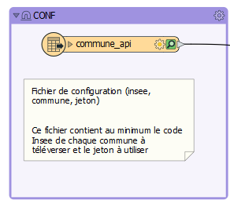
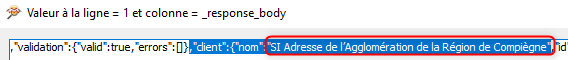
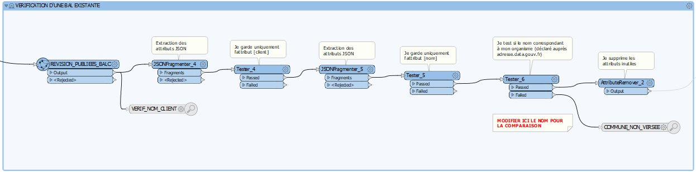
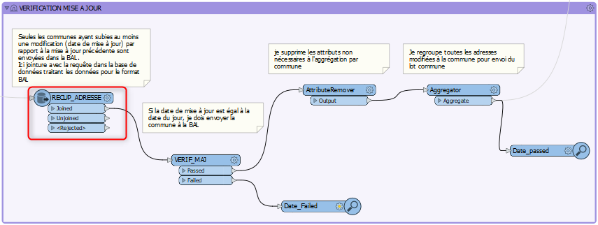
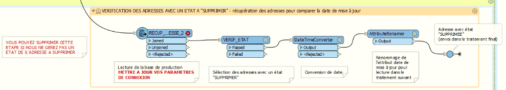
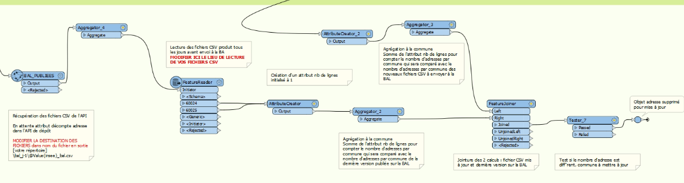
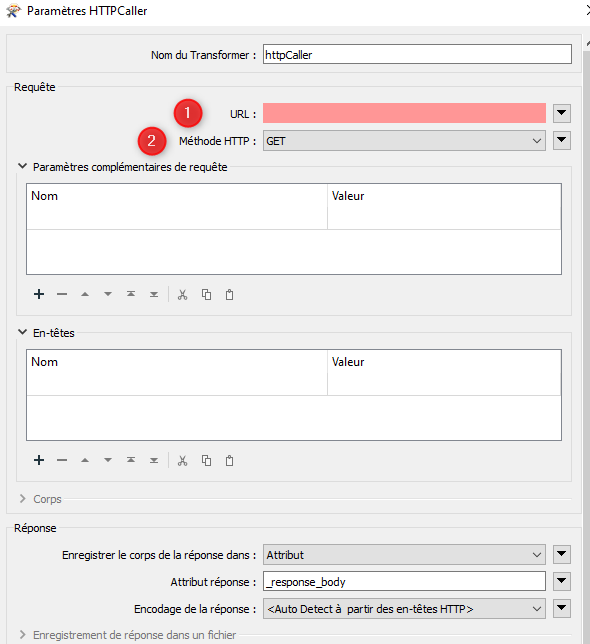

# Paramétrage de l'API BAL pour FME #

## Principe

L'alimentation de la BaseAdresseLocale évolue et permet à présent de téléverser les fichiers communaux au format BAL via une API. L'Agglomération de la Région de Compiègne (ARC), signataire de la [charte "Base Adresse Locale"](https://geo.compiegnois.fr/portail/index.php/2021/05/30/adresse-le-compiegnois-sur-la-bonne-voie/), diffuse quotidiennement les informations certifiées de ses communes membres ainsi que celles de trois autres EPCI également signataires de la charte, à savoir la Communauté de Communes de la Plaine d'Estrées (CCPE), la Communauté de Communes des Lisières de l'Oise (CCLO) et la Communauté de Communes des 2 Vallées (CC2V). 

Le service SIG qui utilise déjà l'ETL FME de la société "Safe Software" pour l'ensemble de ces traitements, a paramétré un projet pour utiliser cette API.

Contact : sig@agglo-compiegne.fr

## Changelog

 * --/02/2025 : Version 1.5 - téléversement d'un lot de données communal au format BAL 1.4 avec la nouvelle API de dépôt BAL avec vérification d'une BAL existante, vérification des mises à jour d'adresses intégrant un état ou un objet adresse supprimé (par lecture de la variable `rowCount`) (à venir)
 * 07/02/2025 : Version 1.4 - téléversement d'un lot de données communal au format BAL 1.4 dans la nouvelle API de dépôt BAL avec vérification d'une BAL existante (mode test)
 * 09/04/2024 : Version 1.3 - téléversement d'un lot de données communal au format BAL 1.4 dans l'API de dépôt BAL avec vérification d'une BAL existante, vérification des mises à jour d'adresses intégrant un état ou un objet adresse supprimé (par lecture de la variable `rowCount`)
 * 06/12/2021 : Version 1.2 - téléversement d'un lot de données communal au format BAL 1.3 dans l'API de dépôt BAL avec vérification d'une BAL existante et vérification des mises à jour d'adresses
 * 21/09/2021 : Version 1 - téléversement d'un fichier ou d'un lot de données communal au format BAL 1.2 dans l'API de démo BAL
 
## Gabarit

- [Téléchargement du projet FME version 1.4 - traitement par lot Nouvelle API (démo en test jusqu'au 10 février 2025)](https://geo.compiegnois.fr/documents/metiers/rva/API_BAL_LOT_FME_v14_demo_test_csv_github)
- [Téléchargement du projet FME version 1.3 - traitement par lot + mise à jour des adresses supprimées par lecture de la variable `rowsCount` ](https://geo.compiegnois.fr/documents/metiers/rva/API_BAL_LOT_FME_v13_csv_github.zip)
- [Téléchargement du projet FME version 1.2 - traitement par lot + mise à jour des adresses supprimées par lecture des fichies CSV](https://geo.compiegnois.fr/documents/metiers/rva/API_BAL_LOT_FME_v12_csv_github.zip)
- [Téléchargement du projet FME version 1.1 - traitement par lot](https://geo.compiegnois.fr/documents/metiers/rva/API_BAL_LOT_FME_v11_github.zip)

## Paramétrage

La version 1.3 supprime la partie de vérification des adresses par des fichiers CSV historisés. Cette vérification se fait désormais par la comparaison du nombre d'adresses présent dans la base de données avant le téléversement et la variable de l'API `rowCount` qui compte le nombre d'adresses présent dans la dernière version de la BAL téléversée.

Cette version 1.2 est une version permettant le téléversement en masse de x communes, avec une vérification de la présence d'une BAL existante (pour un autre client),  des dates de mises à jour et la suppression d'adresses (par un état ou par suppression des objets) par rapport à l'API de dépôt de la BAL. La version de FME utilisée est la 2021.1.1.0.

Les paramètres passés dans le traitement sont tous issus de la [documentation de l'API BAL de la BaseAdresseNationale](https://github.com/etalab/ban-api-depot/wiki/Documentation).

#### 1 - Création du fichier de configuration

Afin de téléverser un lot de communes dans l'API BAL, nous avons choisi de créer un fichier Excel contenant la liste des communes à téléverser. Ce fichier est à intégrer comme une donnée source au début du traitement. Ce fichier peut contenir une ou plusieurs communes.

Exemple de structuration du fichier Excel de configuration :

|insee|commune|jeton|epci|
|:---|:---|:---|:---|
|60159|Compiègne|[jeton fournit par la BAL]|ARC|
|60325|Jaux|[jeton fournit par la BAL]|ARC|

**ATTENTION** : si vous utilisez une autre clé pour la référence de vos communes comme le code SIREN, qui est également référencé dans vos fichiers BAL de commune, vous devez remplacer l'attribut insee par siren dans le fichier de conf. Ce remplacement devra être réalisé également dans les paramètres du traitement ci-dessous. Un attribut EPCI a été ajouté uniquement pour la gestion du fichier Excel dans le cas d'un traitement multiple d'EPCI. Cet attribut permet de trier les communes pour y copier les jetons plus facilement.

### 2 - Création de la chaîne de traitement

#### 2.1 - Insérer le fichier de conf comme `Données sources`

Ensuite sélectionner le format Excel et indiquer le lieu de votre fichier.

Votre fichier de configuration est en début de chaîne.
 
#### 2.2 - Vérification d'une BAL existante

**Prérequis : il est préférable de s'assurer du nom de client déclaré dans l'API de dépôt pour mettre à jour le traitement au niveau du test d'existence d'une BAL**. Pour cela vous pouvez utiliser le Workflow en activant l'`Inspector` nommé 'VERIF_NOM_CLIENT'. Dans la chaîne renvoyée, vous pouvez vérifier le nom de votre organisme.

Ce contrôle permet de vérifier l'existence d'une BAL publiée par un autre organisme. En cas de retour positif de l'API de dépôt, la ou les communes en question sortent du traitement pour ne pas être téléversées. En effet, le fonctionnement de l'API supprimerait la BAL publiée par un autre organisme. Si le cas se présente, une investigation devra être réalisée pour déterminer l'origine de la publication par l'utilisateur.

**Cette partie du traitement peut être désactivée pour un versionnement initial à condition de s'être assuré de la non présence de BAL existante sur son territoire de téléversement.**

#### 2.3 - Vérification d'une mise à jour d'adresse

**Pour un versement initial via l'API de dépôt, vous devez désactiver ce traitement et relier directement le point 2.1 ou 2.2 au point 2.5 dans le Workflow. Une fois cette initialisation réalisée, vous pouvez réactiver ce traitement.**

Ce contrôle permet de sélectionner uniquement les communes dont au moins une adresse a été modifiée ou ajoutée pour être téléversées dans l'API de dépôt. Le fonctionnement de l'API de dépôt créant une historisation à chaque versionnement, ce filtre évite de surcharger la base nationale en données non modifiées.

**Note** : ce traitement ne gère pas pour le moment le fait qu'une adresse ait été supprimée. Le format BAL ne gérant pas l'état d'une adresse, si une adresse est supprimée d'une commune, elle ne sera pas pris en compte dans la mise à jour. Ce cas est en cours de résolution et le Workflow sera complété. 

Le transformers `DatabaseJoiner` est utilisé pour récupérer les données existantes (au format BAL) dans une base de données, avant d'être comparée à la date du jour. Il doit être paramétré en fonction de l'infrastructure des données de l'utilisateur. 

#### 2.4 - Vérification des adresses supprimées

Le versement des BAL, via l'API de dépôt, est réalisé à partir des fichiers CSV exportés tous les jours. Ces fichiers comprennent uniquement les adresses existantes. Ce contrôle permet donc de sélectionner les communes dont au moins une adresse a été supprimée pour être téléversées dans l'API de dépôt. Ce filtre permet de rechercher les adresses avec un état à "supprimer"(1) ou les objets "adresse" supprimés(2). Dans ces 2 cas, si une adresse est concernée, la commune est mise à jour via l'API de dépôt.

(1) l'Agglomération de la Région de Compiègne a développé un [modèle de données local](https://github.com/sigagglocompiegne/rva/blob/master/bdd/doc_admin_bd_adresse.md) permettant de gérer plus finement les adresses que le format BAL. Ce modèle intègre un "état". Cet attribut permet de ne pas supprimer un point d'adresse si celle-ci n'est plus utilisée (démolition ...).

Le traitement intègre une passe de lecture de la base source pour sélectionner les adresses avec un état "supprimée" avec leur date de mise à jour. Ce dernier attribut est renommé afin d'être envoyé dans le traitement global. Si une adresse ressort et que sa mise à jour est intervenue dans la journée, l'ensemble de la BAL communale est envoyée dans le traitement principale de l'API de dépôt pour mise à jour.

(2) l'objet "adresse", à savoir le point localisant l'adresse est supprimé. Cette vérification est réalisée à partir de la lecture des derniers fichiers CSV exportés et comparés avec la dernière version de la BAL publiée via l'API de dépôt (on compare le nombre d'adresses).

Le traitement effectue une récupération des dernières BAL publiées au format .csv (comptage des adresses) pour une comparaison avec la dernière version des fichiers BAL CSV exportés avant mise à jour vers l'API de dépôt. Si cette comparaison est différente, alors l'ensemble de la BAL communale concernée est envoyée dans le traitement principale de l'API de dépôt pour mise à jour. Cette passe pourra être remplacée par un appel à l'API lorsque celle-ci intégrera une variable décomptant le nombre d'adresses de la dernière version publiée (évolution de l'API de dépôt à venir). 

Ce traitement par récupération des BAL publiées sur l'API et la comparaison avec les futurs BAL à publier est transitoire, dans l'attente de l'évolution de l'API par la mise à disposition d'un attribut de décompte.
 
#### 2.5 - Paramétrer un HttpCaller pour lancer la 1er requête nommée `REVISION`
 
 
 
 
 
 Paramètres à indiquer dans ce transformer :
 
 https://plateforme.adresse.data.gouv.fr/api-depot/communes/@Value(insee)/revisions

L'attribut `@Value(insee)` correspond au code insee de la commune à téléverser et présent dans le fichier de conf.

 **POST**

 Nom **Authorization:** et Valeur **Token @Value(jeton)**

L'attribut `@Value(jeton)` correspond au jeton contenant la clé fournie par la BAL et indiqué dans le fichier de conf pour chaque commune (ici nous saisirons donc la clé de démonstration dans un premier temps).
 
  **Specify Upload Body**
 
  (ouvrir l'éditeur de texte et copier le code ci-dessous)
 
 `{
  "context": {
    "nomComplet": "[votre nom]",
    "organisation": "[organisme]", 
    "extras": {
      "internal_id": ""
    }
  }
}`

  **JSON (application/json)**
 
 Laisser les autres paramètres par défaut. L'attribut de réponse `_response_body` sera utilisé dans la suite du traitement et correspond au code de retour de l'API.
 
#### 2.6 - Récupération de l'attribut `_ID` dans la requête de réponse de `REVISION` pour lancer la 2nd requête nommée `TELEVERSEMENT`
  
La réponse de l'API s'effectue au format JSON, il faut donc récupérer les différents attributs utiles pour la suite du traitement et notamment l'`_ID`.

 - Extraction des attributs JSON avec le transformer `JSONFragmenter`

 
 
  Paramètres à indiquer dans ce transformer :
 
 
 
  **Attribut JSON**
 
  **_response_body**
 
  **json[*]**
 
  **JSON**
 
  - Conserver uniquement l'attribut `_ID` avec un simple transformer `Tester`

 
 
 L'attribut `json_index` liste l'ensemble des attributs de la requête de réponse. Il suffit de filter avec le nom `_id` pour récupérer en sortie uniquement la valeur de celui-ci dans l'attribut `_response_body`.

#### 2.7 - Paramétrer un HttpCaller pour lancer la 2nd requête nommée `TELEVERSEMENT`
 

 
 Paramètres à indiquer dans ce transformer :
 
 https://plateforme.adresse.data.gouv.fr/api-depot/revisions/@Value(_response_body)/files/bal

L'attribut `@Value(_response_body)` contient la valeur de l'ID récupérée précédemment et à passer dans cette requête.

 **PUT**

 Nom **Content-MD5:** et Valeur  **1234567890abcdedf1234567890abcdedf**

L'attribut de la taille en octet du fichier n'a pas été intégré dans ce traitement (optionnel dans l'API).

 Nom **Authorization:** et Valeur **Token @Value(jeton)**

L'attribut `@Value(jeton)` correspond au jeton contenant la clé fournie par la BAL et indiqué dans le fichier de conf pour chaque commune (ici nous saisirons donc la clé de démonstration dans un premier temps).
 
  **Envoyer à partir d'un fichier**
 
  (indiquer le chemin de votre fichier BAL au format csv). Dans le chemin d'accès au fichier intégrer le code insee présent dans le fichier de conf `@Value(insee)` car vos fichiers doivent contenir ce code (ex: `c:\temp\@Value(insee)_bal.csv`)

  **text/csv**
 
 Laisser les autres paramètres par défaut. L'attribut de réponse `_response_body` sera utilisé dans la suite du traitement et correspond au code de retour de l'API.

#### 2.8 - Récupération de l'attribut `revisionId` dans la requête de réponse de `TELEVERSEMENT` pour lancer la 3ème requête nommée `VALIDATION`
  
La réponse de l'API s'effectue au format JSON, il faut donc récupérer les différents attributs utiles pour la suite du traitement et notamment `revisionId`.

 - Extraction des attributs JSON avec le transformer `JSONFragmenter`

Reprendre la méthode indiquée au point **3**.
 
  - Conserver uniquement l'attribut `revisionId` avec un simple transformer `Tester`
 
Reprendre la méthode indiquée au point **3**.

 L'attribut `json_index` liste l'ensemble des attributs de la requête de réponse. Il suffit de filter avec le nom `revisionId` pour récupérer en sortie uniquement la valeur de celui-ci dans l'attribut `_response_body`.

#### 2.9 - Paramétrer un HttpCaller pour lancer la 3ème requête nommée `VALIDATION`
 

 
 Paramètres à indiquer dans ce transformer :
 
 https://plateforme.adresse.data.gouv.fr/api-depot/revisions/@Value(_response_body)/compute

L'attribut `@Value(_response_body)` contient la valeur de l'ID récupérée précédemment et à passer dans cette requête.

 **POST**

 Nom **Authorization:** et Valeur **Token @Value(jeton)**

L'attribut `@Value(jeton)` correspond au jeton contenant la clé fournie par la BAL et indiqué dans le fichier de conf pour chaque commune (ici nous saisirons donc la clé de démonstration dans un premier temps).
 
  Les paramètres de la précédente requête peuvent être gardée par défaut (pas d'incidence sur la requête)
 
Laisser les autres paramètres par défaut. L'attribut de réponse `_response_body` sera utilisé dans la suite du traitement et correspond au code de retour de l'API.

#### 2.10 - Récupération de l'attribut `_id` dans la requête de réponse de `VALIDATION` pour lancer la 4ème requête nommée `PUBLICATION`
  
La réponse de l'API s'effectue au format JSON, il faut donc récupérer les différents attributs utiles pour la suite du traitement et notamment l'`_id`.

 - Extraction des attributs JSON avec le transformer `JSONFragmenter`

Reprendre la méthode indiquée au point **3**.
 
  - Conserver uniquement l'attribut `revisionId` avec un simple transformer `Tester`
 
Reprendre la méthode indiquée au point **3**.

 L'attribut `json_index` liste l'ensemble des attributs de la requête de réponse. Il suffit de filter avec le nom `_id` pour récupérer en sortie uniquement la valeur de celui-ci dans l'attribut `_response_body`.

#### 2.11 - Paramétrer un HttpCaller pour lancer la 4ème requête nommée `PUBLICATION`
 

 
 Paramètres à indiquer dans ce transformer :
 
 https://plateforme.adresse.data.gouv.fr/api-depot/revisions/@Value(_response_body)/publish

L'attribut `@Value(_response_body)` contient la valeur de l'ID récupérée précédemment et à passer dans cette requête.

 **POST**

 Nom **Authorization:** et Valeur **Token @Value(jeton)**

L'attribut `@Value(jeton)` correspond au jeton contenant la clé fournie par la BAL et indiqué dans le fichier de conf pour chaque commune (ici nous saisirons donc la clé de démonstration dans un premier temps).
 
  Les paramètres de la précédente requête peuvent être gardée par défaut (pas d'incidence sur la requête)
 
Laisser les autres paramètres par défaut. L'attribut de réponse `_response_body` sera utilisé dans la suite du traitement et correspond au code de retour de l'API.

#### 2.12 - Lancement du traitement

Pour lancer le traitement, cliquer sur

 
 

## B - Exploitation

#### 1 - Les résultats obtenus

Il est possible de lire les réponses renvoyées par l'API après chaque `HttpCaller` en cliquant sur  après la fin du traitement. Cela peut-être utile si la requête est rejetée via le port de sortie `Rejected`.

#### 2 - Récupération des informations de la BAL

La [documentation de l'API BAL de la BaseAdresseNationale](https://github.com/etalab/ban-api-depot/wiki/Documentation) indique qu'il est possible d'interroger la BAL en mode libre par des requêtes `GET`.

Sur le même principe que les requêtes de téléversement, il est possible d'utiliser le transformer `HttpCaller` pour cela. Ce transformer peut-être insérer à la suite de la requête `PUBLICATION`.

 

 https://plateforme.adresse.data.gouv.fr/api-depot/communes/@Value(insee)/revisions

Cette requête renvoie toutes les révisions. Pour récupérer la version courante utilisez cette requête `https://plateforme.adresse.data.gouv.fr/api-depot/communes/@Value(insee)/current-revision`.

L'attribut `@Value(insee)` correspond au code insee de la commune téléversée.

 **GET**

En cliquant sur , après la fin du traitement, vous pouvez consulter le retour de l'API. Ce retour contient toutes les révisions effectuées sur la commune interrogée.

