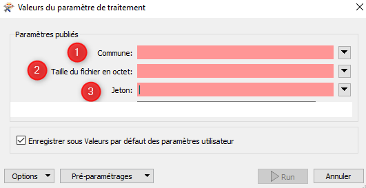

# Paramétrage de l'API BAL pour FME #

## Principe

L'alimentation de la BaseAdresseLocale évolue et permet à présent de téléverser les fichiers communaux au format BAL via une API. L'Agglomération de la Région de Compiègne, signataire de la [charte "Base Adresse Locale"](https://geo.compiegnois.fr/portail/index.php/2021/05/30/adresse-le-compiegnois-sur-la-bonne-voie/), diffuse quotidiennement les informations certifiées des communes du Pays Compiégnois. 

Le service SIG qui utilise déjà l'ETL FME de la société "Safe Software" pour l'ensemble de ces traitements, a paramétré un projet pour utiliser cette API.

Contact : sig@agglo-compiegne.fr

## Changelog

 * 23/09/2021 : Version 0.2 - téléversement d'un lot de données communal au format BAL 1.2 dans la BaseAdresseLocale via l'API
 * 20/09/2021 : Version 0.1 - téléversement d'un fichier commune au format BAL 1.2 dans la BaseAdresseLocale via l'API

## Gabarit

- [Téléchargement du projet FME - traitement par commune](https://geo.compiegnois.fr/documents/metiers/rva/API_BAL_FME.zip) (détail de la méthode partie A)
- [Téléchargement du projet FME - traitement par lot](https://geo.compiegnois.fr/documents/metiers/rva/API_BAL_LOT_FME.zip) (détail de la méthode partie B)

## Paramétrage

Cette première version est une version béta permettant le téléversement soit d'un seul fichier BAL commune à la fois, soit d'un téléversement en masse de x communes. La version de FME utilisée est la 2021.1.1.0.

Les paramètres passés dans le traitement sont tous issus de la [documentation de l'API BAL de la BaseAdresseNationale](https://github.com/etalab/ban-api-depot/wiki/Documentation).

## A - Traitement fichier par fichier

### 1 - Création de paramètres publiés

Certains valeurs peuvent être paramétrées au lancement du traitement FME pour faciliter le processus de téléversement. Vous devez créer 3 paramètres publiés :
 - Commune : cet attribut contiendra le code Insee de la commune à téléverser
 - Taille : cet attribut contiendra la taille du fichier à téléverser en octet (une amélioration sera apportée au projet pour automatiser la récupération de la taille du fichier)
 - Jeton : cet attribut contiendra votre clé jeton fournit par la BAL

### 2 - Création de la chaîne de traitement

#### 2.1 - Initié un `Creator` qui permettra le lancement du traitement
 
 
 
 
#### 2.2 - Paramétrer un HttpCaller pour lancer la 1er requête nommée `REVISION`
 
 
 
 
 
 Paramètres à indiquer dans ce transformer :
 
 https://plateforme.adresse.data.gouv.fr/api-depot-demo/communes/$(Commune)/revisions

L'attribut `$(Commune)` correspond au paramètre publié Commune contenant le code Insee de celle-ci.

 **POST**

 Nom **Authorization:** et Valeur **Token $(Jeton)**

L'attribut `$(Jeton)` correspond au paramètre publié Jeton contenant la clé fournie par la BAL (ici nous saisirons donc la clé de démonstration dans un premier temps).
 
  **Specify Upload Body**
 
  (ouvrir l'éditeur de texte et copier le code ci-dessous)
 
 `{
  "context": {
    "nomComplet": "[votre nom]",
    "organisation": "[organisme]", 
    "extras": {
      "internal_id": ""
    }
  }
}`

  **JSON (application/json)**
 
 Laisser les autres paramètres par défaut. L'attribut de réponse `_response_body` sera utilisé dans la suite du traitement et correspond au code de retour de l'API.
 
#### 2.3 - Récupération de l'attribut `_ID` dans la requête de réponse de `REVISION` pour lancer la 2nd requête nommée `TELEVERSEMENT`
  
La réponse de l'API s'effectue au format JSON, il faut donc récupérer les différents attributs utiles pour la suite du traitement et notamment l'`_ID`.

 - Extraction des attributs JSON avec le transformer `JSONFragmenter`

 
 
  Paramètres à indiquer dans ce transformer :
 
 
 
  **Attribut JSON**
 
  **_response_body**
 
  **json[*]**
 
  **JSON**
 
  - Conserver uniquement l'attribut `_ID` avec un simple transformer `Tester`

 
 
 L'attribut `json_index` liste l'ensemble des attributs de la requête de réponse. Il suffit de filter avec le nom `_id` pour récupérer en sortie uniquement la valeur de celui-ci dans l'attribut `_response_body`.

#### 2.4 - Paramétrer un HttpCaller pour lancer la 2nd requête nommée `TELEVERSEMENT`
 

 
 Paramètres à indiquer dans ce transformer :
 
 https://plateforme.adresse.data.gouv.fr/api-depot-demo/revisions/@Value(_response_body)/files/bal

L'attribut `@Value(_response_body)` contient la valeur de l'ID récupérée précédemment et à passer dans cette requête.

 **PUT**

 Nom **Content-Length:** et Valeur **($Taille)** + Nom **Content-MD5:** et Valeur  **1234567890abcdedf1234567890abcdedf**

L'attribut `$(Taille)` correspond au paramètre publié Taille contenant la taille du fichier téléversé en octet.

 Nom **Authorization:** et Valeur **Token $(Jeton)**

L'attribut `$(Jeton)` correspond au paramètre publié Jeton contenant la clé fournie par la BAL (ici nous saisirons donc la clé de démonstration dans un premier temps).
 
  **Envoyer à partir d'un fichier**
 
  (indiquer le chemin de votre fichier BAL au format csv). Dans le chemin d'accès au fichier vous pouvez intégrer la paramètre publié ($Commune) si vos fichiers contiennent le code insee (ex: `c:\temp\$(Commune)_bal.csv`)

  **text/csv**
 
 Laisser les autres paramètres par défaut. L'attribut de réponse `_response_body` sera utilisé dans la suite du traitement et correspond au code de retour de l'API.

#### 2.5 - Récupération de l'attribut `revisionId` dans la requête de réponse de `TELEVERSEMENT` pour lancer la 3ème requête nommée `VALIDATION`
  
La réponse de l'API s'effectue au format JSON, il faut donc récupérer les différents attributs utiles pour la suite du traitement et notamment `revisionId`.

 - Extraction des attributs JSON avec le transformer `JSONFragmenter`

Reprendre la méthode indiquée au point **3**.
 
  - Conserver uniquement l'attribut `revisionId` avec un simple transformer `Tester`
 
Reprendre la méthode indiquée au point **3**.

 L'attribut `json_index` liste l'ensemble des attributs de la requête de réponse. Il suffit de filter avec le nom `revisionId` pour récupérer en sortie uniquement la valeur de celui-ci dans l'attribut `_response_body`.

#### 2.6 - Paramétrer un HttpCaller pour lancer la 3ème requête nommée `VALIDATION`
 

 
 Paramètres à indiquer dans ce transformer :
 
 https://plateforme.adresse.data.gouv.fr/api-depot-demo/revisions/@Value(_response_body)/compute

L'attribut `@Value(_response_body)` contient la valeur de l'ID récupérée précédemment et à passer dans cette requête.

 **POST**

 Nom **Authorization:** et Valeur **Token $(Jeton)**

L'attribut `$(Jeton)` correspond au paramètre publié Jeton contenant la clé fournie par la BAL (ici nous saisirons donc la clé de démonstration dans un premier temps).
 
  Les paramètres de la précédente requête peuvent être gardée par défaut (pas d'incidence sur la requête)
 
Laisser les autres paramètres par défaut. L'attribut de réponse `_response_body` sera utilisé dans la suite du traitement et correspond au code de retour de l'API.

#### 2.7 - Récupération de l'attribut `_id` dans la requête de réponse de `VALIDATION` pour lancer la 4ème requête nommée `PUBLICATION`
  
La réponse de l'API s'effectue au format JSON, il faut donc récupérer les différents attributs utiles pour la suite du traitement et notamment l'`_id`.

 - Extraction des attributs JSON avec le transformer `JSONFragmenter`

Reprendre la méthode indiquée au point **3**.
 
  - Conserver uniquement l'attribut `revisionId` avec un simple transformer `Tester`
 
Reprendre la méthode indiquée au point **3**.

 L'attribut `json_index` liste l'ensemble des attributs de la requête de réponse. Il suffit de filter avec le nom `_id` pour récupérer en sortie uniquement la valeur de celui-ci dans l'attribut `_response_body`.

#### 2.8 - Paramétrer un HttpCaller pour lancer la 4ème requête nommée `PUBLICATION`
 

 
 Paramètres à indiquer dans ce transformer :
 
 https://plateforme.adresse.data.gouv.fr/api-depot-demo/revisions/@Value(_response_body)/publish

L'attribut `@Value(_response_body)` contient la valeur de l'ID récupérée précédemment et à passer dans cette requête.

 **POST**

 Nom **Authorization:** et Valeur **Token $(Jeton)**

L'attribut `$(Jeton)` correspond au paramètre publié Jeton contenant la clé fournie par la BAL (ici nous saisirons donc la clé de démonstration dans un premier temps).
 
  Les paramètres de la précédente requête peuvent être gardée par défaut (pas d'incidence sur la requête)
 
Laisser les autres paramètres par défaut. L'attribut de réponse `_response_body` sera utilisé dans la suite du traitement et correspond au code de retour de l'API.

#### 2.9 - Lancement du traitement

Pour lancer le traitement, cliquer sur

 
 
et dans la boîte de dialogue saisir les paramètres publiés nécessaires au traitement

 

 Code Insee de la commune à téléverser

 Taille du fichier en octet

 Votre clé jeton

#### 2.10 - Les résultats obtenus

Il est possible de lire les réponses renvoyées par l'API après chaque `HttpCaller` en cliquant sur  après la fin du traitement. Cela peut-être utile si la requête est rejetée via le port de sortie `Rejected`.

#### 2.11 - Récupération des informations de la BAL

La [documentation de l'API BAL de la BaseAdresseNationale](https://github.com/etalab/ban-api-depot/wiki/Documentation) indique qu'il est possible d'interroger la BAL en mode libre par des requêtes `GET`.

Sur le même principe que les requêtes de téléversement, il est possible d'utiliser le transformer `HttpCaller` pour cela. Ce transformer peut-être insérer à la suite de la requête `PUBLICATION`.

 

 https://plateforme.adresse.data.gouv.fr/api-depot-demo/communes/$(Commune)/revisions

L'attribut `$(Commune)` correspond au paramètre publié Commune contenant le code Insee de la commune téléversée.

 **GET**

En cliquant sur , après la fin du traitement, vous pouvez consulter le retour de l'API. Ce retour contient toutes les révisions effectuées sur la commune interrogée.

## B - Traitement par lot

Le traitement par lot diffère légèrement du traitement fichier par fichier. Les paramètres publiés sont abandonnés au profit d'un fichier de configuration. Il en va de même pour le paramètre de la taille du fichier qui n'est plus utilisé (optionnel pour l'API).

#### 1 - Création du fichier de configuration

Afin de téléverser un lot de communes dans l'API BAL, nous avons choisi de créer un fichier Excel contenant la liste des communes à téléverser. Ce fichier est à intégrer comme données sources au début du traitement.

Exemple de structuration du fichier Excel de configuration :

|insee|commune|jeton|
|:---|:---|:---|
|60159|Compiègne|[jeton fournit par la BAL]|
|60325|Jaux|[jeton fournit par la BAL]|

#### 2 - Paramétrage du traitement FME

La suppression des paramètres publiés par un fichier de conf modifie les valeurs d'attributs à intégrer comme paramètres dans les tranformers `HttpCaller`. Seuls les éléments modifiés par rapport au traitement par fichier sont présentés ci-dessous par requête. Les autres paramètres sont identiques à la partie B.

 - requête **REVISION** :

Le paramètre `$(commune)` doit être remplacé par `@Value(insee)` dans l'URL : 

**URL** = https://plateforme.adresse.data.gouv.fr/api-depot-demo/communes/@Value(insee)/revisions

Le paramètre `$(Jeton)` doit être remplacé par `@Value(jeton)` dans l'en-tête : 

**Valeur** = Token @Value(jeton)

 - requête **TELEVERSEMENT**, **VALIDATION** et **PUBLICATION**:

Le paramètre `$(Jeton)` doit être remplacé par `@Value(jeton)` dans l'en-tête : 

**Valeur** = Token @Value(jeton)

Dans le chemin du fichier à charger le paramètre `$(commune)` doit être remplacé par `@Value(insee)`

