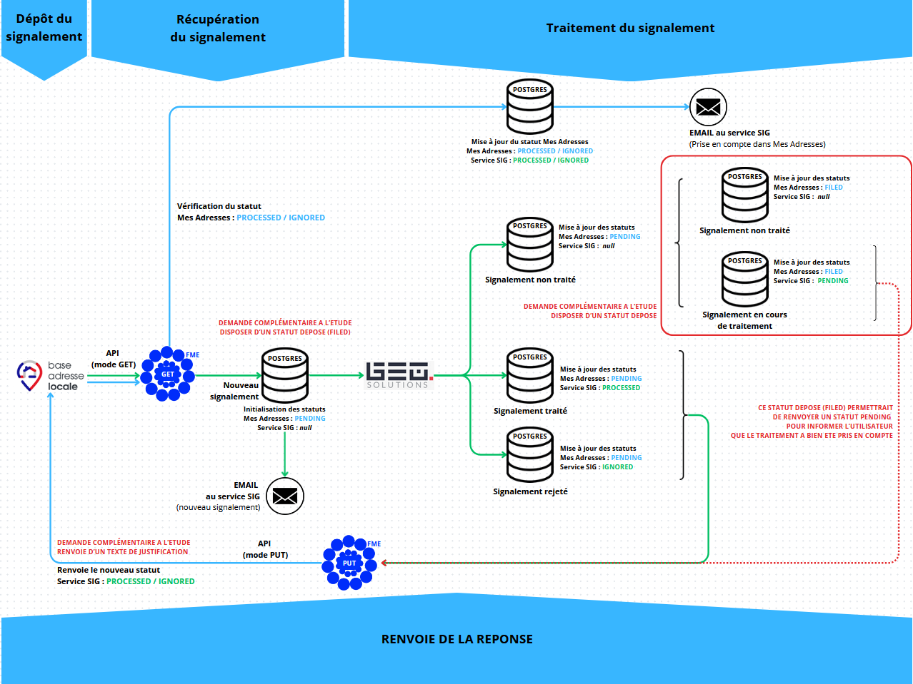

# Gestion des signalements sur "Mes adresses" via l'API "Mes signalements"

Des signalements peuvent être déposés sur "Mes Adresses" depuis 2025. Un test est réalisé en cours sur la commune de Verberie, dans l'attente d'ouverture aux autres communes.

Ces signalements sont gérés par le GéoCompiégnois. Pour cela, un processus a été mis en place à partir de l'API "Mes signalements" pour les récupérer et les gérer dans l'environnement applicatif actuel :

    . Récupération des signalements avec l'API depuis l'ETL FME
    . Intégration dans la base de données
    . Visibilité des signalements dans l'application "Voies et Adresses" avec un visuel et une fiche spécifiques
    . Gestion du signalement dans l'application "Voies et Adresses"
    . Renvoi de la réponse via l'API depuis l'ETL FME

# Paramétrage de l'API de signalement "Mes Adresses" pour FME #

## Principe

L'alimentation de la BaseAdresseLocale évolue. En 2025, l'intégration de signalements d'adresses sera introduit dans l'applicatif "Mes Adresses". Le service SIG de l'ARC, partenaire des 4 EPCI téléversant déjà ses adresses via l'API de dépôt, a développé un processus automatique, en complément de son application Web "Voies et Adresses", pour récupérer les signalements déposés, les traiter et renvoyer une réponse. Les communes ne seront pas destinaires des signalements directement déposés sur "Mes Adresses".

Le service SIG qui utilise déjà l'ETL FME de la société "Safe Software" pour l'ensemble de ces traitements, a paramétré deux projets pour utiliser cette API de signalement. Ils peuvent être utilisés séparemment en-dehors d'une automatisation sous FMEFlow (FME Server).

Le développment de l'API étant toujours en cours au niveau national, les traitements ne sont pas diffusés à ce jour.

Contact : sig@agglo-compiegne.fr

## Changelog

 * 19/02/2025 : Version 0.1 - récupération des signalements "Mes Adresses" en GET et renvoie d'une réponse en PUT
 
## Gabarit

- Téléchargement du projet FME version 0.1 - Mode GET (en cours de développement et test)
- Téléchargement du projet FME version 0.1 - Mode PUT (en cours de développement et test)

## Schéma fonctionnel

Le SIG de l'Agglomération de la Région de Compiègne est structuré autour d'une base de données Postgres/Gis sur laquelle repose des applicatifs métiers WEB sous GEO. La méthode de récupération et de traitement des données de signalements est propre à cette structure. Néanmoins, ce fonctionnel peut-être repris et adapté pour d'autres territoires car la première partie des traitements est la lecture de l'API en mode GET. Le traitement du PUT est quant à lui commun dans sa partie finale (envoie des variables de retour).

Le service SIG de l'ARC a mis en place une gestion des statuts du signalement parallèle à celui issu des signalements. Ce mode paralèlle de gestion permet de vérifier, si une fois le signalement retourné (en mode PUT) celui-ci est bien pris en compte dans "Mes Adresses" par récupération de la nouvelle valeur du statut renvoyé par l'API GET.

## Paramétrage

(en développement)
