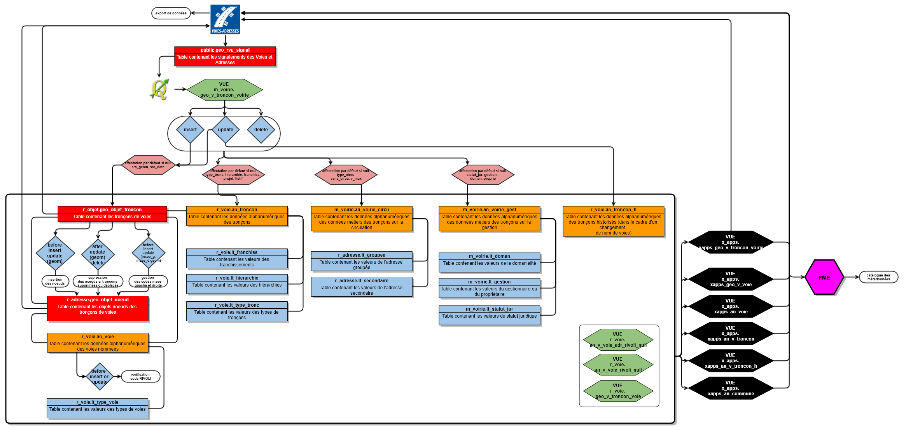
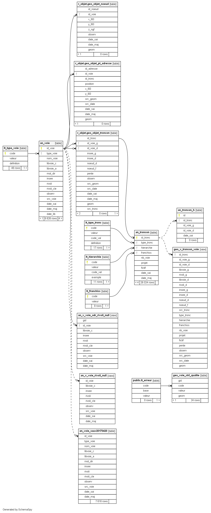
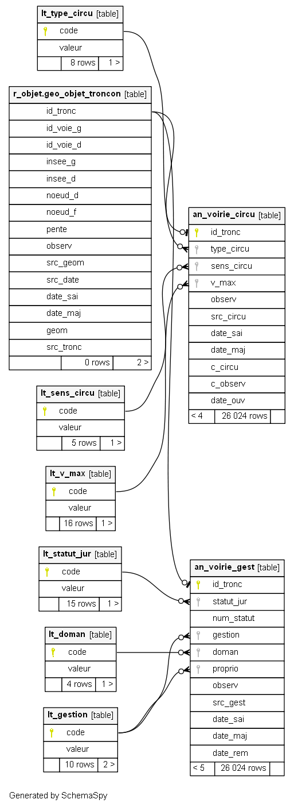

# Documentation d'administration de la base Voie #

## Principes
  * **généralité** :
Afin d'améliorer la connaissance sur les voies existantes, une Base de Voies a été initiée sur le Pays Compiégnois à partir d'un travail de regroupement des bases de voies existantes (IGN, cadastre,...) et d'un travail de vérification sur le terrain. Cette base est alimentée par les signalements des communes via une application WebSIG dédiée. Elle est également liée à la Base des Adresses Locales.
 
 * **résumé fonctionnel** :
La base de données Voies fonctionne de manière urbanisée. La géométrie du tronçon de voies est gérée de manière indépendante et contient uniquement les informations de référence et d'appartenance à une voie nommée et à une commune. Les données dites métiers sont gérées dans des tables alphanumériques spécifiques. Il existe des informations liées à des données de références du tronçon et des informations liées aux métiers de la voirie (gestion et circulation). Un suivi des voies historiques a également été introduit.
L'ensemble de cette base est modifiable via des vues simples en base de données et consultable via les applicatifs WebSIG à partir de vues matérialisées reconstituant les informations à la voie ou au tronçon.

## Schéma fonctionnel

## Modèle conceptuel simplifié

## Dépendances (non critiques)

Sans objet

## Classes d'objets

L'ensemble des classes d'objets de gestion sont stockés dans plusieurs schémas r_objet (pour la géométrie des points d'adresse), r_voie, m_voirie (pour les informations alphanumériques liéesa aux tronçons de voies), et celles applicatives dans les schémas x_apps (pour les applications pro) ou x_apps_public (pour les applications grands publiques).

 ### classes d'objets de gestion :
  
   `r_objet.geo_objet_troncon` : table des tronçons de voies.
   
|Nom attribut | Définition | Type | Valeurs par défaut |
|:---|:---|:---|:---|
|id_tronc|Identifiant unique de l'objet tronçon|bigint|nextval('r_objet.geo_objet_troncon_id_seq'::regclass)|
|id_voie_g|Identifiant unique de l'objet voie à gauche du tronçon|bigint| |
|id_voie_d|Identifiant unique de l'objet voie à droite du tronçon|bigint| |
|insee_g|Code INSEE à gauche du tronçon|character varying(5)| |
|insee_d|Code INSEE à droite du tronçon|character varying(5)| |
|noeud_d|Identifiant du noeud de début du tronçon|bigint| |
|noeud_f|Identifiant du noeud de fin de tronçon|bigint| |
|pente|Pente exprimée en % et calculée à partir des altimétries des extrémités du tronçon|numeric| |
|observ|Observations|character varying(254)| |
|src_geom|Référentiel de saisie|character varying(5)|'00'::bpchar|
|src_date|Année du millésime du référentiel de saisie|character varying(4)|'0000'::bpchar|
|date_sai|Horodatage de l'intégration en base de l'objet|timestamp without time zone|now()|
|date_maj|Horodatage de la mise à jour en base de l'objet|timestamp without time zone| |
|geom|Géomètrie linéaire de l'objet|LineString,2154| |
|src_tronc|Source des informations au tronçon|character varying(100)| |

Particularité(s) à noter :
* Une clé primaire existe sur le champ `id_tronc` lui-même contenant une séquence pour l'attribution automatique d'une référence tronçon unique. 
* Une clé étrangère existe sur la table de valeur `id_voie_d` (lien vers l'identifiant `id_voie` de la table `r_voie.an_voie`)
* Une clé étrangère existe sur la table de valeur `id_voie_g` (lien vers l'identifiant `id_voie` de la table `r_voie.an_voie`)
* Une clé étrangère existe sur la table de valeur `src_geom` (source du référentiel géographique pour la saisie `r_objet.lt_src_geom`).
* Une clé étrangère existe sur la table de valeur `noeud_d` (table des objets noeuds `r_objet.geo_objet_noeud`).
* Une clé étrangère existe sur la table de valeur `noeud_f` (table des objets noeuds `r_objet.geo_objet_noeud`).
* Un index est présent sur le champ geom
* 3 triggers :
  * `t_t1_noeud_insert` : avant insertion ou mise à jour, recherche si il existe un noeud de épart ou de fin, sinon création des noeud du tronçon
  * `t_t2_noeud_sup` : après suppression ou mise à jour, si il n'y a aucun noeud dans la table des noeuds alors on supprime tout, sinon suppression uniquement des noeuds ne faisant plus partie d'un début ou d'une fin.
  * `t_t3_maj_insee_gd` : avant insertion ou mise à jour, recherche code insee et nom de la commune à droite et à gauche du tronçon.
  
---

   `r_objet.geo_objet_noeud` : Table des noeuds constituant le début et la fin d'un tronçon
   
|Nom attribut | Définition | Type | Valeurs par défaut |
|:---|:---|:---|:---|
|id_noeud|Identifiant unique de l'objet noeud|bigint|nextval('r_objet.geo_objet_noeud_id_seq'::regclass)|
|id_voie|Identifiant unique de l'objet voie|bigint| |
|x_l93|Coordonnée X en mètre|numeric| |
|y_l93|Coordonnée Y en mètre|numeric| |
|z_ngf|Altimétrie ngf du noeud en mètre|numeric| |
|observ|Observations|character varying(254)| |
|date_sai|Horodatage de l'intégration en base de l'objet|timestamp without time zone|now()|
|date_maj|Horodatage de la mise à jour en base de l'objet|timestamp without time zone| |
|geom|Géomètrie ponctuelle de l'objet|Point,2154| |

Particularité(s) à noter :
* Une clé primaire existe sur le champ `id_noeud`
* Une clé étrangère exsiste sur la table de valeur `id_voie` (table r_voie.an_voie des voies nommées)
* Un index est présent sur le champ geom
  
---

`r_voie.an_troncon` : Table alphanumérique des tronçons

|Nom attribut | Définition | Type  | Valeurs par défaut |
|:---|:---|:---|:---|  
|id_tronc|Identifiant unique de l'objet tronçon|bigint| |
|type_tronc|Type de troncon|character varying(2)|'00'::bpchar|
|hierarchie|Niveau hierarchique du troncon dans la trame viaire|character varying(1)|'0'::bpchar|
|franchiss|Indication d'un franchissement|character varying(2)|'ZZ'::bpchar|
|nb_voie|Nombre de voies sur le tronçon|integer| |
|projet|Indication de l'état de projet du tronçon|boolean|false|
|fictif|Indication de la prise en compte du tronçon dans des calculs|boolean|false|
|date_sai|Horodatage de l'intégration en base de l'objet|timestamp without time zone|now()|
|date_maj|Horodatage de la mise à jour en base de l'objet|timestamp without time zone| |

Particularité(s) à noter : aucune
* Une clé primaire existe sur le champ `id_tronc`
* Une clé étrangère exsiste sur la table de valeur `franchiss` (liste de valeur `lt_franchiss` définissant le type de franchissement en les tronçons)
* Une clé étrangère exsiste sur la table de valeur `hierarchie` (liste de valeur `lt_hierarchie` définissant le niveau hiérarchique pour la représentation cartographique)
* Une clé étrangère exsiste sur la table de valeur `type_tronc` (liste de valeur `lt_type_tronc` définissant le type de tronçon)

---

`r_voie.an_troncon_h` : Table alphanumérique des tronçons historisés

|Nom attribut | Définition | Type  | Valeurs par défaut |
|:---|:---|:---|:---|
|id|Identifiant unique de l'historisation|bigint|nextval('r_voie.an_troncon_h_id_seq'::regclass)|
|id_tronc|Identifiant unique de l'objet tronçon|bigint| |
|id_voie_g|Identifiant de l'objet voie gauche|bigint| |
|id_voie_d|Identifiant de l'objet voie droite|bigint| |
|date_sai|Date de saisie dans la base de données|timestamp without time zone|now()|

Particularité(s) à noter :
* Une clé primaire existe sur le champ `id` avec une séquence d'incrémentation automatique (`r_voie.an_troncon_h_id_seq`)

---

`r_voie.an_voie` : Table alphanumérique des voies nommmées

Se référer à la documentation de la base Adresse pour plus de détail sur cette table.

---

`public.geo_rva_signal` : Table des signalements des Voies et Adresses saisies par les collectivités

Se référer à la documentation de la base Adresse pour plus de détail sur cette table.

---

`m_voirie.an_voirie_circu` : Table alphanumérique des éléments de circulation de la voirie

|Nom attribut | Définition | Type  | Valeurs par défaut |
|:---|:---|:---|:---|
|id_tronc|Identifiant du tronçon|bigint| |
|type_circu|Type de circulation principale|character varying(2)|'00'::bpchar|
|sens_circu|Indique si le sens de circulation du tronçon|character varying(2)|'00'::bpchar|
|v_max|Vitesse maximale autorisée pour un véhicule léger|character varying(3)|'000'::bpchar|
|observ|Observations|character varying(254)| |
|src_circu|Référence principale utilisée pour les éléments de circulation|character varying(100)| |
|date_sai|Date de saisie dans la base de données|timestamp without time zone|now()|
|date_maj|Date de la dernière mise à jour dans la base de données|timestamp without time zone| |
|c_circu|Liste des codes des contraintes de circulation. Lien non dynamique avec la liste des valeurs lt_cont_circu. Incrémentation par GEO par défaut dans la table des signalements (public.geo_rva_signal) et dans l'attribut c_circu comme suit : 10;20 ...  (...)
|c_observ|Champ libre pour détailler le type de restriction (ex : hauteur de 4,10 m, ...)|character varying(1000)| |
|date_ouv|Date d'ouverture du tronçon à la circulation (soit l'année entière est saisie soit une partie en remplaçant les 0 par des x)|character(4)| |

Particularité(s) à noter :
* Une clé primaire existe sur le champ `id_tronc` avec une séquence d'incrémentation automatique
* Une clé étrangère exsiste sur la table de valeur `id_tronc` (lien nécessaire avec la table de référence des tronçons `r_objet.geo_objet_troncon`)
* Une clé étrangère exsiste sur la table de valeur `sens_circu` (liste de valeur `lt_sens_circu` définissant le sens de circulation)
* Une clé étrangère exsiste sur la table de valeur `type_circu` (liste de valeur `lt_type_circu` définissant le type de circulation)
* Une clé étrangère exsiste sur la table de valeur `v_max` (liste de valeur `lt_v_max` définissant la vitesse maximum autorisée sur le tronçon)
* Un index est présent sur les attributs sens_circu, type_circu, v_max 
  
  
---

`m_voirie.an_voirie_gest` : Table alphanumérique des éléments de gestion de la voirie

|Nom attribut | Définition | Type  | Valeurs par défaut |
|:---|:---|:---|:---|
|id_tronc|Identifiant du tronçon|bigint| |
|statut_jur|Statut juridique du tronçon de la voie|character varying(2)|'00'::bpchar|
|num_statut|Numéro de statut du tronçon de la voie|character varying(10)| |
|gestion|Gestionnaire du tronçon de la voie|character varying(2)|'00'::bpchar|
|doman|Domanialité du tronçon|character varying(2)|'00'::bpchar|
|proprio|Propriétaire du tronçon|character varying(2)|'00'::bpchar|
|observ|Observations|character varying(254)| |
|src_gest|Référence principale utilisée pour les éléments de gestion|character varying(100)| |
|date_sai|Date de saisie dans la base de données|timestamp without time zone|now()|
|date_maj|Date de la dernière mise à jour dans la base de données|timestamp without time zone| |
|date_rem|Date de la dernière remise en état de la chaussée (soit l''année entière est saisie soit une partie en remplaçant les 0 par des x)|character(4)| |

Particularité(s) à noter :
* Une clé primaire existe sur le champ `id_tronc` avec une séquence d'incrémentation automatique
* Une clé étrangère exsiste sur la table de valeur `id_tronc` (lien nécessaire avec la table de référence des tronçons `r_objet.geo_objet_troncon`)
* Une clé étrangère exsiste sur la table de valeur `doman` (liste de valeur `lt_doman` définissant le type de domanialité)
* Une clé étrangère exsiste sur la table de valeur `gestion` (liste de valeur `lt_gestion` définissant le gestionnaire)
* Une clé étrangère exsiste sur la table de valeur `proprio` (liste de valeur `lt_gestion` définissant le propriétaire)
* Une clé étrangère exsiste sur la table de valeur `statut_jur` (liste de valeur `lt_statut_jur` définissant le statut juridique)
* Un index est présent sur les attributs doman, gestion, num_statut, proprio
---

`m_voirie.geo_v_troncon_voirie` : Vue éditable destinée à la modification des données relatives au troncon et à ses propriétés métiers de circulation et de gestion

* 5 triggers :
  * `t_t1_geo_objet_troncon` : pour une instance d'insertion, de mise à jour ou de suppression écriture des informations saisies dans la table des objets tronçons.
  * `t_t2_an_troncon` : pour une instance d'insertion, de mise à jour ou de suppression écriture des informations saisies dans la table des données métiers tronçons
  * `t_t2_an_voirie_circu` : pour une instance d'insertion, de mise à jour ou de suppression écriture des informations saisies dans la table des données de circulation
  * `t_t2_an_voirie_gest` : pour une instance d'insertion, de mise à jour ou de suppression écriture des informations saisies dans la table des données de gestion
  * `t_t3_an_troncon_h` : pour une instance de mise à jour écriture des informations dans la table des données historique

`r_voie.geo_v_troncon_voirie` : Vue de synthèse de la base de voie (pas d''information métier voirie)

`r_voie.an_v_voie_rivoli_null` : Vue d'exploitation permettant d'identifier les voies adressées sans code RIVOLI

`r_voie.an_v_voie_adr_rivoli_null` : Vue d'exploitation permettant d'identifier les voies sans code RIVOLI

---

### classes d'objets applicatives métiers sont classés dans le schéma x_apps :
 
`x_apps.xapps_an_v_troncon` : Vue non géographiques des tronçons (agréagation des tronçons pour statistique à la commune) (générateur d'apps). Cette vue matérialisée est rafraichit toutes les jours via un fichier batch sur la VM sig-sgbd.
 
`x_apps.xapps_an_v_troncon_h` : Vue d'exploitation permettant de lister les adresses historiques et supprimées (intégration dans la fiche adresse dans l''application GEO RVA et utilisation dans la recherche des anciennes adresses)

`x_apps.xapps_geo_v_troncon_voirie` : Vue matérilaisée complète et décodée des données relatives au troncon et à ses propriétés métiers de circulation et de gestion, destinée à l'exploitation applicative (générateur d'apps). Cette vue est rafraîchie automatiquement toutes les nuits. Au besoin un rafraîchissement ponctuel est possible.

`x_apps.xapps_geo_v_voie` : Vue de synthèse des voies (agréagation des tronçons pour calcul) (générateur d'apps)
Cette vue matérialisée est rafraichit toutes les jours via un fichier batch sur la VM sig-sgbd.

`x_apps.xapps_an_commune` : Vue simple des communes du Pays Compiégnois pour lier un lien de téléchargement d'un fichier OpenData dans GEO.

### classes d'objets applicatives grands publics sont classés dans le schéma x_apps_public :

Sans objet

### classes d'objets opendata sont classés dans le schéma x_opendata :

Sans objet

## Liste de valeurs

`r_objet.lt_src_geom` : Liste des valeurs permettant de décrire le référentiel géographique utilisé pour la saisie des données

Se référerer à la documentation de la base de données Adresse pour plus d'informations.

---

`r_voie.lt_franchiss` : Liste des valeurs permettant de décrire le type de franchissement

|Nom attribut | Définition | Type  | Valeurs par défaut |
|:---|:---|:---|:---|    
|code|Code de la liste énumérée relative au type de franchissement du tronçon|character varying(2)| |
|valeur|Valeur de la liste énumérée relative au type de franchissement du tronçon|character varying(254)| |

Particularité(s) à noter :
* Une clé primaire existe sur le champ code 

Valeurs possibles :

|Code|Valeur|
|:---|:---|
|00|Non renseigné|
|01|Pont|
|02|Tunnel|
|03|Passage à niveau sur voie ferrée|
|04|Porche (passage sous un bâtiment)|
|05|Escalier|
|06|Passerelle|
|99|Autre|
|ZZ|Non concerné|

---

`r_voie.lt_hierarchie` : Liste des valeurs permettant de décrire le type de hiérarchie utilisée pour la représentation cartographique

|Nom attribut | Définition | Type  | Valeurs par défaut |
|:---|:---|:---|:---|    
|code|Code de la liste énumérée relative à la hierarchisation du troncon dans la trame viaire|character varying(2)| |
|valeur|Valeur de la liste énumérée relative à la hierarchisation du troncon dans la trame viaire|character varying(80)| |
|code_val|Couple Code-Valeur de la liste énumérée relative à la hierarchisation du troncon dans la trame viaire|character varying(80)| |
|exemple|Exemple de troncon adapté à la catégorie|character varying(254)| |

Particularité(s) à noter :
* Une clé primaire existe sur le champ code 

Valeurs possibles :

|Code|Valeur|Exemple|
|:---|:---|:---|
|1|Voie d'interêt national ou régional||
|2|Voie structurant l'aire urbaine||
|3|Ceinture de desserte d'agglomération||
|4|Voie de desserte urbaine||
|5|Voie principale hors agglomération||
|6|Voie principale communale||
|7|Voie inter-quartier||
|8|Voie de desserte locale||
|9|Autre||
|0|Non renseigné||
|Z|Non concerné||

---

`r_voie.lt_type_tronc` : Liste des valeurs permettant de décrire le type de tronçon

|Nom attribut | Définition | Type  | Valeurs par défaut |
|:---|:---|:---|:---|    
|code|Code de la liste énumérée relative au type de tronçon|character varying(2)| |
|valeur|Valeur de la liste énumérée relative au type de tronçon|character varying(80)| |
|code_val|Couple Code-Valeur de la liste énumérée relative au type de tronçon|character varying(80)| |
|definition|Définition de la liste énumérée relative au type de tronçon|character varying(254)| |

Particularité(s) à noter :
* Une clé primaire existe sur le champ code 

Valeurs possibles :

|Code|Valeur|Définition|
|:---|:---|:---|
|00|Non renseigné||
|10|Troncon de type routier||
|11|Autoroute|Route sans croisement accessible uniquement en certains points, réservée à certains véhicules motorisés et de statut autoroutier|
|12|Voie rapide/express|Route sans croisement accessible uniquement en certains points, réservée à certains véhicules motorisés, de statut non autoroutier|
|13|Bretelle|Dispositif de liaison ou voie d'accès|
|14|Route|Route goudronnée|
|15|Chemin|Chemin permettant la circulation de véhicules ou d'engins d'exploitation|
|20|Troncon de type cyclable||
|21|Voie cyclable|Voie réservée à un usage cyclable|
|30|Troncon de type piéton||
|31|Sentier|Chemin étroit ne permettant pas le passage de véhicules|
|32|Passerelle|Passerelle supportant une allée|
|33|Escalier|Escalier|
|40|Troncon hors réseau||
|41|Parking|Voie de stationnement interne|
|99|Autre||
|ZZ|Non concerné||

---

`m_voirie.lt_cont_circu` : Liste des valeurs permettant de décrire les contraintes de circulation

|Nom attribut | Définition | Type  | Valeurs par défaut |
|:---|:---|:---|:---|    
|code|Code de la liste énumérée relative aux contraintes de circulation possible (hors vitesse)|character varying(3)| |
|valeur|Valeur de la liste énumérée relative aux contraintes de circulation possible (hors vitesse)|character varying(80)| |

Particularité(s) à noter :
* Une clé primaire existe sur le champ code 
* Cette table ne fait pas l'objet d'une relation via une clé étrangère sur la table de gestion des données circulation (`an_voirie_circu`). Elle est intégrée seulement à QGIS pour permettre une saisie multiple de contrainte dans un formulaire de saisie.

Valeurs possibles :

|Code|Valeur|
|:---|:---|
|10|Hauteur|
|20|Largeur|
|30|Poids|
|40|Marchandises dangereuses|
|50|Type de véhicule|

---

`m_voirie.lt_doman` : Liste des valeurs permettant de décrire le type de domanialité

|Nom attribut | Définition | Type  | Valeurs par défaut |
|:---|:---|:---|:---|
|code|Code de la liste énumérée relative à la domanialité du tronçon|character varying(2)| |
|valeur|Valeur de la liste énumérée relative à la domanialité du tronçon|character varying(80)| |

Particularité(s) à noter :
* Une clé primaire existe sur le champ code 

Valeurs possibles :

|Code|Sous code|Valeur|Référence législative|Référence réglementaire|
|:---|:---|:---|:---|:---|
|01|Public|
|02|Privé|
|00|Non renseigné|
|ZZ|Non concerné|

---

`m_voirie.lt_gestion` : Liste des valeurs permettant de définir le gestionnaire

|Nom attribut | Définition | Type  | Valeurs par défaut |
|:---|:---|:---|:---|
|code|Code de la liste énumérée relative au gestionnaire/propriétaire du tronçon|character varying(2)| |
|valeur|Valeur de la liste énumérée relative au gestionnaire/propriétaire du tronçon|character varying(80)| |

Particularité(s) à noter :
* Une clé primaire existe sur le champ code 

Valeurs possibles :

|Code|Valeur|
|:---|:---|
|00|Non renseigné|
|01|Etat|
|02|Région|
|03|Département|
|04|Intercommunalité|
|05|Commune|
|06|Office HLM|
|07|Privé|
|99|Autre|
|ZZ|Non concerné|

---

`m_voirie.lt_sens_circu` : Liste des valeurs permettant de décrire le sens de circulation

|Nom attribut | Définition | Type  | Valeurs par défaut |
|:---|:---|:---|:---|    
|code|Code de la liste énumérée relative au sens de circulation du tronçon|character varying(2)| |
|valeur|Valeur de la liste énumérée relative au sens de circulation du tronçon|character varying(80)| |

Particularité(s) à noter :
* Une clé primaire existe sur le champ code 

Valeurs possibles :

|Code|Valeur|
|:---|:---|
|00|Non renseigné|
|01|Double sens|
|02|Sens unique direct (sens de saisie du troncon)|
|03|Sens unique inverse (sens de saisie du troncon)|
|ZZ|Non concerné|

---

`m_voirie.lt_statut_jur` : Liste des valeurs permettant de définir le statut juridique

|Nom attribut | Définition | Type  | Valeurs par défaut |
|:---|:---|:---|:---|    
|code|Code de la liste énumérée relative au statut juridique du tronçon|character varying(2)| |
|valeur|Valeur de la liste énumérée relative au statut juridique du tronçon|character varying(254)| |

Particularité(s) à noter :
* Une clé primaire existe sur le champ code 

Valeurs possibles :

|Code|Valeur|
|:---|:---|
|00|Non renseigné|
|01|Autoroute|
|02|Route Nationale|
|03|Route Départementale|
|04|Voie d'Interêt Communautaire|
|05|Voie Communale|
|06|Chemin Rural|
|07|Chemin d'Exploitation|
|08|Chemin Forestier|
|09|Chemin de Halage|
|10|Voie Privée|
|11|Piste Cyclable|
|12|Voie Verte|
|99|Autre statut|
|ZZ|Non concerné|

---

`m_voirie.lt_type_circu` : Liste des valeurs permettant de décrire le type de circulation

|Nom attribut | Définition | Type  | Valeurs par défaut |
|:---|:---|:---|:---|    
|code|Code de la liste énumérée relative au type de circulation sur un tronçon|character varying(2)| |
|valeur|Valeur de la liste énumérée relative au type de circulation sur un tronçon|character varying(80)| |

Particularité(s) à noter :
* Une clé primaire existe sur le champ code 

Valeurs possibles :

|Code|Valeur|
|:---|:---|
|00|Non renseigné|
|01|Routier|
|02|Cyclable|
|03|Piéton|
|04|Mixte à dominante routière|
|05|Mixte à dominante cyclable|
|06|Mixte à dominante piétonne|
|07|Mixte sans dominante particulière|

---

`m_voirie.lt_v_max` : Liste des valeurs permettant de décrire la vitesse maximum autorisée

|Nom attribut | Définition | Type  | Valeurs par défaut |
|:---|:---|:---|:---|    
|code|Code de la liste énumérée relative à la vitesse maximale autorisée pour un véhicule léger|character varying(3)| |
|valeur|Valeur de la liste énumérée relative à la vitesse maximale autorisée pour un véhicule léger|character varying(80)| |

Particularité(s) à noter :
* Une clé primaire existe sur le champ code 

Valeurs possibles :

|Code|Valeur|
|:---|:---|
|000|Non renseigné|
|010|10 km/h|
|015|15 km/h|
|020|20 km/h|
|030|30 km/h|
|040|40 km/h|
|045|45 km/h|
|050|50 km/h|
|060|60 km/h|
|070|70 km/h|
|080|80 km/h|
|090|90 km/h|
|110|110 km/h|
|130|130 km/h|
|999|Autre vitesse|
|ZZZ|Non concerné|

---

## Traitement automatisé mis en place (Workflow de l'ETL FME)

### Gestion des procédures de contrôle des données Adresse

L'ensemble des fichiers a utilisé est placé ici `Y:\Ressources\4-Partage\3-Procedures\FME\prod\RVA`.

**Vérification de la qualité des adresse** `RVA_ctrl_qualite_voie.fmw`

Une table d'erreur a été initiée pour l'ensemble de ces contrôles `public.lt_erreur`
|code|Code de la liste des erreurs suite à un contrôle qualité des données gérées par le service SIG|character varying(5)| |
|base|Nom de la base concernée par le code erreur|character varying(20)| |
|valeur|Valeur de la liste des erreurs suite à un contrôle qualité des données gérées par le service SIG|character varying(100)| |

Valeurs possibles (non exhaustives) :

|Code|Base|Valeur|
|:---|:---|:---|
|2008|RVA|Nombre de logements non saisi|
|2009|RVA|Diagnostic de l'adresse non renseigné|
|1000|RVA|Relation adresse tronçon|
|1001|RVA|Relation adresse voie|
|1002|RVA|Relation adresse cadastre|
|2010|RVA|Incohérence entre le numéro et l'étiquette|
|2012|RVA|Adresse non conforme avec une position trop précise|
|1003|RVA|Adresse BAN non trouvée dans la BAL|
|1004|RVA|Adresse BAL non trouvée dans la BAN|
|2013|RVA|Adresse conforme d'habitation sans logement renseigné|
|2014|RVA|Adresse secondaire avec au moins 1 logement|
|2001|RVA|Référence cadastrale manquante ou mal saisie|
|2015|RVA|Adresse conforme n'est pas groupée|
|2016|RVA|Adresse à dégrouper non groupée|
|2017|RVA|Diagnostic adresse incohérent avec une adresse groupée|
|2018|RVA|Adresse qui ne doit pas comporter de logements|
|3000|RVA|Mauvais code voie affecté au tronçon|
|3001|RVA|Mauvais code insee affecté au tronçon|
|3002|RVA|Code insee manquant|
|3003|RVA|Nombre de voies manquante|
|3004|RVA|Incohérence entre domanialité public et propriété|
|3005|RVA|Incohérence entre domanialité privé et propriété|
|3006|RVA|Incohérence entre statut juridique et gestionnaire|
|3007|RVA|Incohérence entre le type de tronçon et la hiérarchie|
|3008|RVA|Franchissement à Non renseigné|
|3009|RVA|Tronçon non coupé |
|3010|RVA|Tronçon non raccordé|
|2011|RVA|Adresse conforme avec une position non précise|
|2002|RVA|Mauvaise commune d'assignation|
|2003|RVA|Id_voie manquant|
|2004|RVA|Id_tronc manquant|
|2005|RVA|Champ numéro vide|
|2006|RVA|Mauvais indice de répétition|
|2007|RVA|Angle non saisi|

Ce traitement permet de :
- vérifier l'affectation des bons codes voies au tronçon,
- vérifier l'affectation des bons codes insee au tronçon,
- contrôler l'ensemble des champs de saisies (insee null, nb voie null, ...)
- contrôler la domanialité par rapport aux propriétés foncières,
- contrôler la cohérence du statut juridique par rapport au gestionnaire,
- contrôler le type de tronçon par rapport à sa hiérarchie,
- contrôle des géométries (si pas franchissement) sur raccord entre tronçon,
- ...

## Projet QGIS pour la gestion

Un projet QGIS a été réalisé pour la gestion interne des données. Il est stocké ici :
R:\Ressources\4-Partage\3-Procedures\QGIS\RVA_3.x.qgs

## Export Open Data

L'ensemble des fichiers a utilisé est placé ici `R:\Ressources\4-Partage\3-Procedures\FME\prod\OPEN-DATA`.

 - `RVA_voie_metadonnees.fmw` : ce traitement exporte l'ensemble des données Voie à de multiples formats téléchargeables via la fiche de métadonnées (csv, shape, kml, geojson, excel) et il est exécuté tous les jours à 22h30 via FMEServer.

---

