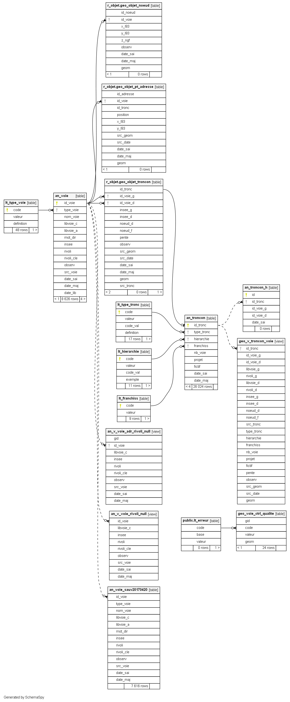

# Documentation d'administration de la base Voie #

## Principes
  * **généralité** :
Afin d'améliorer la connaissance sur les voies existantes, une Base de Voies a été initiée sur le Pays Compiégnois à partir d'un travail de regroupement des bases de voies existantes (IGN, cadastre,...) et d'un travail de vérification sur le terrain. Cette base est alimentée par les signalements des communes via une application WebSIG dédiée. Elle est également liée à la Base des Adresses Locales.
 
 * **résumé fonctionnel** :
La base de données Voies fonctionne de manière urbanisée. La géométrie du tronçon de voies est gérée de manière indépendante et contient uniquement les informations de référence et d'appartenance à une voie nommée et à une commune. Les données dites métiers sont gérées dans des tables alphanumériques spécifiques. Il existe des informations liées à des données de références du tronçon et des informations liées aux métiers de la voirie (gestion et circulation). Un suivi des voies historiques a également été introduit.
L'ensemble de cette base est modifiable via des vues simples en base de données et consultable via les applicatifs WebSIG à partir de vues matérialisées reconstituant les informations à la voie ou au tronçon.

## Dépendances (non critiques)

Sans objet

## Classes d'objets

L'ensemble des classes d'objets de gestion sont stockés dans plusieurs schémas r_objet (pour la géométrie des points d'adresse), r_voie (pour le référentiel de voies), r_adresse (pour les informations alphanumériques liées à l'adresse) ,et celles applicatives dans les schémas x_apps (pour les applications pro) ou x_apps_public (pour les applications grands publiques).

 ### classes d'objets de gestion :
  
   `r_objet.geo_objet_pt_adresse` : table des points d'adresse.
   
|Nom attribut | Définition | Type | Valeurs par défaut |
|:---|:---|:---|:---|
|id_adresse|Identifiant unique de l'objet point adresse|bigint|nextval('r_objet.geo_objet_pt_adresse_id_seq'::regclass)|
|id_voie|Identifiant unique de l'objet voie|bigint| |
|id_tronc|Identifiant unique de l'objet troncon|bigint| |
|position|Type de position du point adresse|character varying(2)| |
|x_l93|Coordonnée X en mètre|numeric| |
|y_l93|Coordonnée Y en mètre|numeric| |
|src_geom|Référentiel de saisie|character varying(2)|'00'::bpchar|
|src_date|Année du millésime du référentiel de saisie|character varying(4)|'0000'::bpchar|
|date_sai|Horodatage de l'intégration en base de l'objet|timestamp without time zone|now()|
|date_maj|Horodatage de la mise à jour en base de l'objet|timestamp without time zone| |
|geom|Géomètrie ponctuelle de l'objet|Point,2154| |

Particularité(s) à noter :
* Une clé primaire existe sur le champ `id_adresse` lui-même contenant une séquence pour l'attribution automatique d'une référence adresse unique. 
* Une clé étrangère exsiste sur la table de valeur `id_troncon` (lien vers un identifiant id_troncon existant de la table `r_objet.geo_objet_troncon`)
* Une clé étrangère exsiste sur la table de valeur `id_voie` (identifiant de la voie nommée `r_voie.an_voie`)
* Une clé étrangère exsiste sur la table de valeur `position` (précision du positionnement du point adresse `r_objet.lt_position`)
* Une clé étrangère exsiste sur la table de valeur `src_geom` (source du référentiel géographique pour la saisie `r_objet.lt_src_geom`).
* Un index est présent sur le champ geom
* 1 trigger :
  * `t_t1_date_maj` : calcul des coordonnées X et Y avant l'insertion ou la mise à jour d'une géométrie ou des champs x_l93 et y_l93.  
  
Une adresse ne peut pas être créée sans qu'il y ait un tronçon de voirie.

---

   `r_objet.an_voie` : Table alphanumérique des voies à circulation terrestre nommées
   
|Nom attribut | Définition | Type | Valeurs par défaut |
|:---|:---|:---|:---|
|id_voie|Identifiant unique de l'objet voie|bigint|nextval('r_voie.an_voie_id_seq'::regclass)|
|type_voie|Type de la voie|character varying(2)|'01'::character varying|
|nom_voie|Nom de la voie|character varying(80)| |
|libvoie_c|Libellé complet de la voie (minuscule et caractère accentué)|character varying(100)| |
|libvoie_a|Libellé abrégé de la voie (AFNOR)|character varying(100)| |
|mot_dir|Mot directeur de la voie|character varying(100)| |
|insee|Code insee|character(5)| |
|rivoli|Code rivoli|character(4)| |
|rivoli_cle|Clé rivoli|character(1)| |
|observ|Observations|character varying(80)| |
|src_voie|Référence utilisée pour le nom de la voie|character varying(100)| |
|date_sai|Date de saisie dans la base de données|timestamp without time zone|now()|
|date_maj|Date de la dernière mise à jour dans la base de données|timestamp without time zone| |
|date_lib|Année du libellé la voie (soit l''année entière est saisie soit une partie en remplaçant les 0 par des x)|character(4)| |

Particularité(s) à noter :
* Une clé primaire existe sur le champ `idvoie`
* Une clé étrangère exsiste sur la table de valeur `type_voie` (liste de valeur `lt_type_voie` définissant les abréviations des types de voies)
* Un index est présent sur le champ libvoie_c
* 1 trigger :
  * `t_date_maj` : insertion de la date du jour avant la mise à jour
  
---

`r_adresse.an_adresse` : Table alphanumérique des adresses

|Nom attribut | Définition | Type  | Valeurs par défaut |
|:---|:---|:---|:---|  
|id_adresse|Identifiant unique de l'objet point adresse|bigint| |
|numero|Numéro de l'adresse|character varying(10)| |
|repet|Indice de répétition de l'adresse|character varying(10)| |
|complement|Complément d'adresse|character varying(80)| |
|etiquette|Etiquette|character varying(10)| |
|angle|Angle de l'écriture exprimé en degré, par rapport à l'horizontale, dans le sens trigonométrique|integer| |
|observ|Observations|character varying(254)| |
|src_adr|Origine de l'adresse|character varying(2)|'00'::bpchar|
|diag_adr|Diagnostic qualité de l'adresse|character varying(2)|'00'::bpchar|
|qual_adr|Indice de qualité simplifié de l'adresse|character varying(1)|'0'::character varying|
|verif_base|Champ informant si l'adresse a été vérifié par rapport aux erreurs de bases (n°, tronçon, voie, correspondance BAN).
Par défaut à non.|boolean|false|

Particularité(s) à noter : aucune
* Une clé primaire existe sur le champ `id_adresse`
* Une clé étrangère exsiste sur la table de valeur `diag_adr` (liste de valeur `lt_diag_adr` définissant le type de diagnostic de l'adresse)
* Une clé étrangère exsiste sur la table de valeur `qual_adr` (liste de valeur `lt_qual_adr` définissant la qualité de l'adresse)
* Une clé étrangère exsiste sur la table de valeur `src_adr` (liste de valeur `lt_src_adr` définissant les sources de l'adresse)

---

`r_adresse.an_adresse_info` : Table alphanumérique des informations complémentaires des adresses

|Nom attribut | Définition | Type  | Valeurs par défaut |
|:---|:---|:---|:---|
|id_adresse|Identifiant unique de l'objet point adresse|bigint| |
|dest_adr|Destination de l'adresse (habitation, commerce, ...)|character varying(2)|'00'::character varying|
|etat_adr|Etat de la construction à l'adresse (non commencé, en cours, achevé, muré, supprimé ...)|character varying(2)|'00'::character varying|
|refcad|Référence(s) cadastrale(s)|character varying(254)| |
|nb_log|Nombre de logements|integer| |
|pc|Numéro du permis de construire|character varying(30)| |
|groupee|Adresse groupée (O/N)|character varying(1)|'0'::character varying|
|secondaire|Adresse d'un accès secondaire (O/N)|character varying(1)|'0'::character varying|
|id_ext1|Identifiant d'une adresse dans une base externe (1) pour appariemment|character varying(80)| |
|id_ext2|Identifiant d'une adresse dans une base externe (2) pour appariemment|character varying(80)| |

Particularité(s) à noter :
* Une clé primaire existe sur le champ `id_adresse`
* Une clé étrangère exsiste sur la table de valeur `id_adresse` de la table geo_objet_pt_adresse
* Une clé étrangère exsiste sur la table de valeur `groupee` (liste de valeur `lt_groupee` définissant si une adresse est considérée comme groupée)
* Une clé étrangère exsiste sur la table de valeur `secondaire` (liste de valeur `lt_secondaire` définissant si une adresse est secondaire)

---

`r_adresse.an_adresse_h` : Table alphanumérique des historisations des adresses suite à une renumérotation

|Nom attribut | Définition | Type  | Valeurs par défaut |
|:---|:---|:---|:---|  
|id|Identifiant unique de l'historisation|bigint|nextval('r_adresse.an_adresse_h_id_seq'::regclass)|
|id_adresse|Identifiant unique de l'objet point adresse|bigint| |
|id_voie|Identifiant unique de la voie|integer| |
|numero|Numéro de l'adresse|character varying(10)| |
|repet|Indice de répétition de l'adresse|character varying(10)| |
|complement|Complément d'adresse|character varying(80)| |
|etiquette|Etiquette|character varying(10)| |
|codepostal|Code postal de l'adresse|character varying(5)| |
|commune|Libellé de la commune|character varying(100)| |
|date_arr|Date de l'arrêté de numérotation remplaçant le numéro historisé ici présent|timestamp without time zone| |
|date_sai|Date de saisie de l'information dans la base|timestamp without time zone|now()|

Particularité(s) à noter :
* Une clé primaire existe sur le champ `id_adresse`

`public.geo_rva_signal` : Table des signalements des Voies et Adresses saisies par les collectivités

|Nom attribut | Définition | Type  | Valeurs par défaut |
|:---|:---|:---|:---|  
|id_signal|Identifiant unique de l'objet de signalement|integer|nextval('geo_rva_signal_id_seq'::regclass)|
|insee|Code INSEE de la commune|character varying(5)| |
|commune|Nom de la commune|character varying(80)| |
|type_rva|Type de référentiel voie/adresse concerné par un signalement|character varying(1)| |
|nat_signal|Nature du signalement|character varying(1)| |
|acte_admin|Indication de la présence ou non d'un document administratif|boolean| |
|observ|Commentaire texte libre pour décrire le signalement|character varying(1000)| |
|op_sai|Nom du contributeur|character varying(254)| |
|mail|Adresse mail de contact du contributeur|character varying(254)| |
|traite_sig|Indication de l'état du traitement du signalement par le service SIG|character varying(1)| |
|x_l93|Coordonnée X en mètre|numeric| |
|y_l93|Coordonnée Y en mètre|numeric| |
|date_sai|Horodatage de l'intégration en base de l'objet|timestamp without time zone|now()|
|date_maj|Horodatage de la mise à jour en base de l'objet|timestamp without time zone| |
|geom|Géomètrie ponctuelle de l'objet|USER-DEFINED| |
|c_circu|Contraintes de circulation|character varying(50)| |
|c_observ|Complément sur les contraintes de circulation|character varying(1000)| |
|v_max|Contraintes de vitesse|character varying(3)| |

Particularité(s) à noter :
* Une clé primaire existe sur le champ `id_signal`
* Index sur le champ `geom`
* Une clé étrangère exsiste sur la table de valeur `nat_signal` de la table lt_nat_signal
* Une clé étrangère exsiste sur la table de valeur `traite_sig` de la table lt_traite_sig
* Une clé étrangère exsiste sur la table de valeur `type_rva` de la table lt_type_rva
* 1 trigger :
  * `t_t1_geo_rva_signal` : à l'insertion recherche du code insee et libellé de la commune, calcul des coordonnées X et Y, date du jour et force la valeur date de mise à jour à null et traite_sig = 1 (non traité). A la mise à jour recherche recherche du code insee et libellé de la commune, calcul des coordonnées X et Y, et date de mise jour = date du jour.

---

`r_adresse.an_v_adresse_bal_ban_commune` : Vue d'exploitation permettant de comparer le nombre d''enregistrement d''adresse par commune entre la BAL et la BAN

`r_adresse.an_v_adresse_bal_commune` : Vue d'exploitation permettant de compter le nombre d''enregistrement d''adresse par commune de la BAL

`r_adresse.an_v_adresse_bal_epci` : Vue d'exploitation permettant de compter le nombre d''enregistrement d''adresse par epci de la BAL

`r_adresse.an_v_adresse_ban_commune` : Vue d'exploitation permettant de compter le nombre d''enregistrement d''adresse par commune dans la BAN

`r_adresse.an_v_adresse_commune` : Vue d'exploitation permettant de compter le nombre d''enregistrement d''adresse par commune

`r_adresse.geo_v_adresse` : Vue éditable destinée à la modification des données relatives aux adresses
* 4 triggers :
  * `t_t1_geo_objet_pt_adresse` : intégration ou mise à jour des données Adresse dans la table des points d'adresse pour une instance d'insertion, de mise à jour ou de suppression (désactivité par défaut pour ce dernier dans la fonction trigger `r_objet.ft_geo_objet_pt_adresse()`)
  * `t_t2_an_adresse` : intégration ou mise à jour des données Adresse dans la table alphanumérique des adresses pour une instance d'insertion, de mise à jour ou de suppression (désactivité par défaut pour ce dernier dans la fonction trigger `r_adresse.ft_an_adresse()`)
  * `t_t3_an_adresse_info` : intégration ou mise à jour des données Adresse dans la table alphanumérique des informations liées aux adresses pour une instance d'insertion, de mise à jour ou de suppression (désactivité par défaut pour ce dernier dans la fonction trigger `r_adresse.ft_an_adresse_info()`)
  * `t_t4_an_adresse_h` : intégration des données Adresse historiques dans la table alphanumérique correspondante pour une instance de mise à jour

---

### classes d'objets applicatives métiers sont classés dans le schéma x_apps :
 
`x_apps.xapps_geo_vmr_adresse` : Vue matérialisée complète et décodée des adresses destinée à l'exploitation applicative  métier (générateur d'apps)
 
`x_apps.xapps_an_v_adresse_h` : Vue d'exploitation permettant de lister les adresses historiques et supprimées (intégration dans la fiche adresse dans l''application GEO RVA et utilisation dans la recherche des anciennes adresses)

### classes d'objets applicatives grands publics sont classés dans le schéma x_apps_public :

`x_apps_public.xappspublic_geo_v_adresse` : Vue complète et décodée des adresses destinée à l'exploitation applicative  publique (générateur d'apps)

### classes d'objets opendata sont classés dans le schéma x_opendata :

`x_opendata.xopendata_an_v_bal` : Vue alphanumérique simplifiée des adresses au format d''échange BAL

`x_opendata.xopendata_geo_v_openadresse` : Vue destinée à la communication extérieure des données relatives aux adresses. Exclusion des adresses supprimées, non attribuées pour projet ou à confirmer

## Liste de valeurs

`r_objet.lt_position` : Liste des valeurs permettant de décrire le type de position de l'adresse

|Nom attribut | Définition | Type  | Valeurs par défaut |
|:---|:---|:---|:---|    
|code|Code de la liste énumérée relative au type de position de l'adresse|character varying(2)| |
|valeur|Valeur de la liste énumérée relative au type de position de l'adresse|character varying(80)| |
|definition|Définition de la liste énumérée relative au type de position de l'adresse|character varying(254)| |
|inspire|Equivalence INSPIRE LocatorDesignatorTypeValue relative au type de position de l'adresse|character varying(80)| |

Particularité(s) à noter :
* Une clé primaire existe sur le champ code 

Valeurs possibles :

|Code|Valeur|
|:---|:---|
|01|Délivrance postale|
|02|Entrée|
|03|Bâtiment|
|04|Cage d'escalier|
|05|Logement|
|06|Parcelle|
|07|Segment|
|08|Service technique|
|00|Non renseigné|

---

`r_objet.lt_src_geom` : Liste des valeurs permettant de décrire le type de référentiel géométrique

|Nom attribut | Définition | Type  | Valeurs par défaut |
|:---|:---|:---|:---|    
|code|Code de la liste énumérée relative au type de référentiel géométrique|character varying(2)| |
|valeur|Valeur de la liste énumérée relative au type de référentiel géométrique|character varying(254)| |

Particularité(s) à noter :
* Une clé primaire existe sur le champ code 

Valeurs possibles :

|Code|Valeur|
|:---|:---|
|10|Cadastre|
|11|PCI vecteur|
|12|BD Parcellaire|
|13|RPCU|
|20|Ortho-images|
|21|Orthophotoplan IGN|
|22|Orthophotoplan partenaire|
|23|Orthophotoplan local|
|30|Filaire voirie|
|31|Route BDTopo|
|32|Route OSM|
|40|Cartes|
|41|Scan25|
|50|Lever|
|51|Plan topographique|
|52|PCRS|
|53|Trace GPS|
|60|Geocodage|
|71|Plan masse vectoriel|
|72|Plan masse redessiné|
|80|Thématique|
|81|Document d'urbanisme|
|82|Occupation du Sol|
|83|Thèmes BDTopo|
|99|Autre|
|00|Non renseigné|
|70|Plan masse|
|61|Base Adresse Locale|

---

`r_voie.lt_type_voie` : Liste des valeurs permettant de décrire le type de voie

|Nom attribut | Définition | Type  | Valeurs par défaut |
|:---|:---|:---|:---|    
|code|Code de la liste énumérée relative au type de voie|character varying(2)| |
|valeur|Valeur de la liste énumérée relative au type de voie|character varying(254)| |
|definition|Definition de la liste énumérée relative au type de voie|character varying(254)| |

Particularité(s) à noter :
* Une clé primaire existe sur le champ code 

Valeurs possibles :

|Code|Valeur|
|:---|:---|
|01|R|Rue|
|02|RTE|Route|
|03|BD|Boulevard|
|04|AV|Avenue|
|05|CHE|Chemin|
|06|ALL|Allée|
|08|CAR|Carrefour|
|09|IMP|Impasse|
|10|LD|Lieu dit|
|11|CITE|Cité|
|12|CLOS|Clos|
|13|COUR|Cour|
|14|CRS|Cours|
|15|CD|Chemin Départemental|
|16|CR|Chemin rural|
|17|CTRE|Centre|
|18|D|Départementale|
|19|GR|Grande Rue|
|20|PARC|Parc|
|21|N|Nationale|
|22|PAS|Passage|
|23|PRV|Parvis|
|24|PL|Place|
|25|PNT|Pont|
|26|PRT|Petite Route|
|27|PORT|Port|
|28|PROM|Promenade|
|29|QU|Quai|
|30|RES|Résidence|
|31|RLE|Ruelle|
|32|RPT|Rond Point|
|34|SQ|Square|
|35|VC|Voie Communale|
|36|VLA|Villa|
|37|VOI|Voie|
|38|VOIR|Voirie|
|39|ZAC|ZAC|
|40|CAV|Cavée|
|41|CHS|Chaussée|
|42|COTE|Côte|
|43|CV|Chemin vicinal|
|44|DOM|Domaine|
|45|PLE|Passerelle|
|33|ZZ|Sente(ier)|
|00|Non renseigné|Non renseigné|
|99|Autre|Autre|
|ZZ|Non concerné|Non concerné|
|46|LOT|Lotissement|

---

`r_adresse.lt_dest_adr` : Liste des valeurs permettant de décrire la destination de l'adresse

|Nom attribut | Définition | Type  | Valeurs par défaut |
|:---|:---|:---|:---|    
|code|Code de la liste énumérée relative au type de voie|character varying(2)| |
|valeur|Valeur de la liste énumérée relative au type de voie|character varying(80)| |
|definition|Definition de la liste énumérée relative au type de voie|character varying(254)| |

Particularité(s) à noter :
* Une clé primaire existe sur le champ code 

Valeurs possibles :

|Code|Valeur|
|:---|:---|
|00|Non renseigné||
|01|Habitation|Appartement, maison ...|
|02|Etablissement|Commerce, entreprise ...|
|03|Equipement urbain|Stade, piscine ...|
|04|Communauté|Maison de retraite, internat, gendarmerie, ...|
|05|Habitation + Etablissement|Logements et commerces à la même adresse|
|99|Autre|Parking, garage privés ...|

---

`r_adresse.lt_diag_adr` : Liste des valeurs permettant de décrire un diagnostic qualité d'une adresse

|Nom attribut | Définition | Type  | Valeurs par défaut |
|:---|:---|:---|:---|    
|code|Code|character(2)| |
|valeur|Valeur|character varying(80)| |

Particularité(s) à noter :
* Une clé primaire existe sur le champ code 

Valeurs possibles :

|Code|Valeur|
|:---|:---|
|00|Non renseigné|
|11|Adresse conforme|
|12|Adresse supprimée|
|20|Adresse à améliorer (position, usage, dégrouper ...)|
|21|Adresse à améliorer (position)|
|22|Adresse à améliorer (usage)|
|23|Adresse à améliorer (dégrouper)|
|24|Adresse à améliorer (logement)|
|25|Adresse à améliorer (état)|
|31|Adresse non attribuée (projet)|
|32|Adresse non numérotée|
|33|Adresse à confirmer (existence, numéro ...)|
|99|Autre|

---

`r_adresse.lt_etat_adr` : Liste des valeurs permettant de décrire l'état de la construction à l''adresse

|Nom attribut | Définition | Type  | Valeurs par défaut |
|:---|:---|:---|:---|
|code|Code de la liste énumérée relative au type de voie|character varying(2)| |
|valeur|Valeur de la liste énumérée relative au type de voie|character varying(80)| |
|definition|Definition de la liste énumérée relative au type de voie|character varying(254)| |

Particularité(s) à noter :
* Une clé primaire existe sur le champ code 

Valeurs possibles :

|Code|Sous code|Valeur|Référence législative|Référence réglementaire|
|:---|:---|:---|:---|:---|
|01|Non commencé|
|02|En cours|
|03|Achevé|
|04|Muré|
|05|Supprimé|
|99|Autre|
|00|Non renseigné|

---

`r_adresse.lt_groupee` : Liste des valeurs permettant de définir si une adresse est groupée ou non

|Nom attribut | Définition | Type  | Valeurs par défaut |
|:---|:---|:---|:---|
|code|Code|character(1)||
|valeur|Valeur|character varying(80)||

Particularité(s) à noter :
* Une clé primaire existe sur le champ code 

Valeurs possibles :

|Code|Valeur|
|:---|:---|
|0|Non renseigné|
|1|Oui|
|2|Non|

---

`r_adresse.lt_qual_adr` : Liste des valeurs permettant de décrire un indice de qualité simplifié d'une adresse

|Nom attribut | Définition | Type  | Valeurs par défaut |
|:---|:---|:---|:---|    
|code|Code|character varying(1)| |
|valeur|Valeur|character varying(80)| |

Particularité(s) à noter :
* Une clé primaire existe sur le champ code 

Valeurs possibles :

|Code|Valeur|
|:---|:---|
|0|Non renseigné|
|1|Bon|
|2|Moyen|
|3|Mauvais|
|9|Autre|

---

`r_adresse.lt_secondaire` : Liste des valeurs permettant de définir si une adresse est un accès secondaire

|Nom attribut | Définition | Type  | Valeurs par défaut |
|:---|:---|:---|:---|    
|code|Code|character varying(1)| |
|valeur|Valeur|character varying(80)| |

Particularité(s) à noter :
* Une clé primaire existe sur le champ code 

Valeurs possibles :

|Code|Valeur|
|:---|:---|
|0|Non renseigné|
|1|Oui|
|2|Non|

---

`r_adresse.lt_src_adr` : Liste des valeurs permettant de décrire l'origine de l'adresse

|Nom attribut | Définition | Type  | Valeurs par défaut |
|:---|:---|:---|:---|    
|code|Code|character varying(2)| |
|valeur|Valeur|character varying(80)| |

Particularité(s) à noter :
* Une clé primaire existe sur le champ code 

Valeurs possibles :

|Code|Valeur|
|:---|:---|
|00|Non renseigné|
|01|Cadastre|
|02|OSM|
|03|BAN|
|04|Intercommunalité|
|05|Commune|
|99|Autre|

---

`public.lt_nat_signal` : Liste des valeurs permettant de décrire la nature du signalement sur le référentiel voie/adresse

|Nom attribut | Définition | Type  | Valeurs par défaut |
|:---|:---|:---|:---|    
|code|Code|character varying(1)| |
|valeur|Valeur|character varying(100)| |

Particularité(s) à noter :
* Une clé primaire existe sur le champ code 

Valeurs possibles :

|Code|Valeur|
|:---|:---|
|0|Non renseigné|
|1|Création|
|2|Modification|
|3|Suppression|
|9|Autre|

---

`public.lt_traite_sig` : Liste des valeurs permettant de décrire l''état du traitement du signalement par le service SIG

|Nom attribut | Définition | Type  | Valeurs par défaut |
|:---|:---|:---|:---|    
|code|Code|character varying(1)| |
|valeur|Valeur|character varying(80)| |

Particularité(s) à noter :
* Une clé primaire existe sur le champ code 

Valeurs possibles :

|Code|Valeur|
|:---|:---|
|0|Non renseigné|
|1|Nouvelle demande|
|2|Demande prise en compte|
|3|Demande traitée|

---

`public.lt_type_rva` : Liste des valeurs permettant de décrire le type de référentiel voie/adresse concerné par un signalement

|Nom attribut | Définition | Type  | Valeurs par défaut |
|:---|:---|:---|:---|    
|code|Code|character varying(1)| |
|valeur|Valeur|character varying(80)| |

Particularité(s) à noter :
* Une clé primaire existe sur le champ code 

Valeurs possibles :

|Code|Valeur|
|:---|:---|
|0|Non renseigné|
|1|Adresse|
|2|Voie|
|9|Autre|

---

## Traitement automatisé mis en place (Workflow de l'ETL FME)

### Gestion des procédures de contrôle des données Adresse

L'ensemble des fichiers a utilisé est placé ici `Y:\Ressources\4-Partage\3-Procedures\FME\prod\RVA`.

**Vérification de la qualité des adresse** `RVA_ctrl_qualite_adresse.fmw`

Ce traitement permet de :
- croiser plusieurs sources de données Adresse pour évaluer d'éventuels oublis d'adresse,
- croiser avec la base des voies pour vérifier la bonne affectation de l'adresse au tronçon et à la voie nommée
- vérifier les cohérences àl 'intérieur de la base Adresse (ex : numméro + repet = etiquette, .....)
- ...

## Export Open Data

L'ensemble des fichiers a utilisé est placé ici `Y:\Ressources\4-Partage\3-Procedures\FME\prod\OPEN-DATA`.

 - `RVA_adresse_metadonnees.fmw` : ce traitement exporte l'ensemble des données Adresse à de multiples formats téléchargeables via la fiche de métadonnées (csv, shape, kml, geojson, excel) et il est exécuté tous les jours à 21h00 sur le serveur sig-applis.

---

## Modèle conceptuel simplifié

## Schéma fonctionnel

