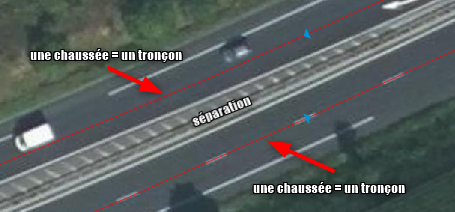

# Prescriptions locales de la base des adresses et des voies locales

(x) en cours de rédaction

# Documentation du standard

# Changelog

- 06/04/2022 : intégration des règles de modélisation des voies 
- 05/02/2021 : description initiale du gabarit de production et de mise à jour des adresses et des voies

# Livrables

## Gabarits

- Fichier hors gabarit des adresses à télécharger au format csv (non géographique) (à venir)
- Fichier hors gabarit des adresses et des voies au format shape (géographique) (à venir)
- Fichier gabarit des adresses et des voies Qgis 3.x (vierge) complet à télécharger (à venir)

## Principe fonctionnel et modalités de mises à jour

La gestion commune des adresses et des voies repose sur le simple principe qu'une adresse doit être conforme, donc disposer d'un numéro de voirie et d'un libellé de voie, et rattachée à une voie nommée.
La constitution d'une base adresse locale a démontré l'intérêt de réaliser en parallèle une base locale des voies pour la collectivité.

Ce couple permet ainsi de rattacher chaque point d'adresse à un tronçon de voies et à une voie nommée. Les automatismes de gestion de la donnée ont été développés autour de ce principe.

La gestion des données des adresses est conforme au standard de l'AITF (association des ingénieurs territoriaux de france). Pour plus d'informations, vous pouvez consulter cette [page](https://aitf-sig-topo.github.io/voies-adresses/). 
Chaque point d'adresse est localisé le plus précisément possible (à l'entrée piétonne pour la précision la plus fine) et rattaché à une voie.

La gestion des voies correspond à une logique de connaissance des caractéristiques des tronçons qui la compose. La modélisation des tronçons repose sur des principes de ruptures.
Ces ruptures sont diverses et peuvent correspondre à des intersections, des coupures aux limites des communes, des changements d'usage, ... 
Les tronçons de voies doivent représenter l'ensemble des circulations possibles (route, chemin, piste cyclable, sentier, ...) dans l'espace public quelque soit le mode de déplacement (motorisé ou non). Les tronçons de voies dans l'espace privé sont à intégrer seulement si ils sont ouvert sur l'espace public.

Les mises à jour des données est réalisées à la fois par des signalements des communes, l'intégration par des mises à jour de référentiels extérieurs ou par des applications tierces utilisant la donnée des adresses.

## Règles de modélisation des tronçons de voies

### Règles générales

La saisie de ces objets doit permettre une **restitution de l'ordre du 1/500ème **.

Le cadre prescriptif autorise certaines modalités d'inventaire en fonction de l'état de connaissance des voies sous réserve que la précision soit suffisante pour respecter l'échelle de restitution indiquée.
Ainsi ;
- l'inventaire pourra se faire uniquement sur des supports de type orthophotographique pour la saisie des voies visibles,
- les parties de voies de type doux (chemin, sentier, ....) n'étant pas identifiable, peuvent faire l'objet d'une saisie à partir d'autres support cartographique comme la BDTopo,
- les parties de voies en projet ou apparues à postériori de la prise de vue du support orthophotographique pourront être intégrées à partir de support de type topographique (plan masse, plan autocad, ...),
- la dénomination des voies (en cohérence avec le fichier FANTOIR ou avec la future base TOPO) pourra être identifiée avec tous les supports disponibles (BDTopo, Scan25, Plan de Ville, PCI Vecteur, ...).

Schéma 1 : Exemple de représentation des objets d'un inventaire cartographique des voies

### La modélisation géométrique

Les règles de modélisation consistent à présenter la façon dont les objets doivent être saisis et restitués dans le gabarit.

Les objets constituant l'inventaire cartographique initial sont organisés autour d'une seule primitive géographique : ligne. 

**La saisie des objets de type multi n'est pas autorisée.**

L'objectif poursuivi dans le cadre de l'inventaire n'est pas celui d'établir un dessin topographique précis mais bien de disposer d'une information nécessaire à la gestion et l'exploitation des tronçons de voies par la collectivité.
A ce titre, des mesures de simplification de la restitution graphique sont prises tout en permettant une rapidité d'exécution accrue pour la saisie initiale et la mise à jour des données. 

(à faire, indiquer les règles de saisie au centre de la voie + troncçon privé fictif,...)

En conséquence, la saisie des tronçons de voies doit respecter les règles ci-dessous :

 - **l'objet est dessiner sur l'axe central de la chaussée identifié,**

Schéma n°2 : Saisie du tronçon sur l'axe centrale de la chaussée

 - **chaque chaussée doit-être représenté,**

Schéma n°3 : Saisie d'un tronçon sur l'axe centrale de la chaussée pour chaque chaussée séparée

 - **le dessin des tronçons de voies doit prendre en compte les aménagements routiers particuliers :**
   - les ronds-points doivent être circulaire (une pré-saisie du cercle dans une couche temporaire puis une transformation en linéaire est nécessaire avant intégration dans la base des voies),

Schéma n°4 : le cas des ronds-points

 - **le dessin des tronçons de voies doit prendre en compte les aménagements routiers particuliers :**
   - les séparations de chaussées dues à un zébra ou un ilôts en centrale doivent être prises en compte

Schéma n°5 et 6 : le cas des îlots et des zébras

 - **les circulations douces doivent être représentées si elles sont séparées de la chaussée, soit par un stationnement, un espace vert ou une rupture (trottoir),**

Schéma n°7 et 8 : Saisie des circulations douces séparées des chaussées principales ou isolées

 - **la continuité des circulations doit être assurée dans le cas d'un aménagement spécifique,**

Schéma n°9 et 10 : Exemple de continuités

 - **les tronçons de voies (chemin, sentier ou amorce de rue pour desservir des adresses) de l'espace privé ouvert sur l'espace public doivent être représentés,**

Schéma n°11 : Exemple de continuités

 - **les tronçons de voies desservant des zones de stationnement ou de parking dans l'espace public ou dans l'espace privé ouvert sur l'espace public doivent être représentés,**

Schéma n°12 : Saisie des allées desserant des zones de stationnement ouvertes

 - **les tronçons de voies doivent être séquent entre eux** sauf dans le cas de franchissement (pont, tunnel, passage à niveau, ...), ou le tronçon doit représenter ce franchissement

Schéma n°13 et 14 : Exemple de franchissement, le tronçon jaune représente le franchissement sur un pont ou sur un passage à niveau

 - **au minimum les tronçons devront être découpés à chaque intersection avec un autre tronçon (hors cas spécifique évoqué plus haut), avec les limites communales et au niveau des entrées et sorties d'agglomération.** Des changements d'usages ou de réglementations routières peuvent également être la cause d'un sectionnement du tronçon entre 2 intersections afin de pouvoir y gérer les informations propres à celui-ci.
 
 
### Topologie

La cohérence topologique impose le partage de géométrie et donc l’utilisation des outils « d’accroches ».

- Tous les objets tronçons sont nécessairement inclus dans une emprise communale,
- Les objets devront être découpés avec les limites communales,
- Les objets ne peuvent pas se superposer (2 tronçons ne peuvent pas partager le même tracé),
- Les objets peuvent partagés la géométrie de la BDTopo si cela est nécessaire,
- Les tronçons doivent être connectés entre eux s'ils sont contigus dans la réalité du dessin saisi,
- Les tronçons servant de limites communales doivent être découpés sur la longueur de ce partage.
- Les linéraires doivent être connectés entre eux s'ils sont contigus dans la réalité du dessin saisi.

- Les arcs de cercle ou ellipses devront être numérisés sous forme de polyligne suffisamment détaillée pour en reproduire la forme. 

### Règles de saisies des attributs

#### Les règles de saisies détaillées des objets tronçon

|Classe d'objets|Représentation|Définition et règle|Type d'objets saisis|Schéma de principe|
|:---|:---|:---|:---|:---|

#### Classes d'attributs complémentaires propre à certains objets

Certaines classes d'objets doivent faire l'objet de complétude par des attributs complémentaires qualitatifs. Le tableau ci-dessous indique les classes d'objets du gabarit qui sont concernées et les attributs à saisir (les valeurs possibles sont listées à la suite du tableau).

|Classe d'objets|Type de saisie (1)|Position (2)|Largeur|
|:---|:---|:---|:---|

(1)  Type de saisie : liste des valeurs décrivant le type de saisie de la sous-classe de précision des objets xxxx

|Valeur|
|:---|

(2) Position : liste des valeurs décrivant la position des objets xxxxx

|Illustration|Valeur|
|:---|:---|

## Règles de modélisation des points d'adresse

(à venir)

## Système de coordonnées

Les coordonnées seront exprimées en mètres avec trois chiffres après la virgule dans le système national en vigueur.
Sur le territoire métropolitain s'applique le système géodésique français légal RGF93 associé au système altimétrique IGN69. La projection associée Lambert 93 France (EPSG:2154) sera à utiliser pour la livraison des données.

## Format des fichiers

Les fichiers sont disponibles au format ESRI Shape (.SHP) contenant la géométrie mais également au format CSV et contenant les coordonnées X et Y pour les points d'adresse.
L'encodage des caractères est en UTF8. Les différents supports sont téléchargeables dans la rubrique Gabarits.

## Description des classes d'objets

|Nom fichier|Définition|Catégorie|Géométrie|
|:---|:---|:---|:---|
|geo_v_adresse|Localisation des points d'adresse |Patrimoine|Ponctuel|
|geo_v_troncon|Localisation des tronçons de voies |Patrimoine|Linéaire|
|geo_objet_noeud|Noeud du filaire de voie à circulation terrestre|Patrimoine|Ponctuel|

## Implémentation informatique

### Patrimoine

Ensemble des données décrivant les objets des points d'adresse

`geo_v_adresse` : points d'adresse

|Nom attribut|Définition|Type|Contraintes|
|:---|:---|:---|:---|
|id_adresse|Identifiant local unique de l'adresse|integer|valeur vide interdite|
|id_voie|Identifiant local unique de la voie|integer|valeur vide interdite|
|id_tronc|Identifiant local unique du tronçon|integer|valeur vide interdite|   
|numero|Numéro de l'adresse|character varying(10)| |
|repet|Indice de répétition de l'adresse|character varying(10)| |
|complement|Complément d'adresse|character varying(80)| |
|ld_compl|Lieu-dit historique ou complémentaire|character varying(80)| |
|etiquette|Etiquette|character varying(10)| |
|angle|Angle de l'écriture exprimé en degré|integer|Par rapport à l'horizontale, dans le sens trigonométrique|
|observ|Observations|character varying(254)| |
|src_adr|Origine de l'adresse|character varying(2)|Liste de valeur lt_src_adr|
|diag_adr|Diagnostic qualité de l'adresse|character varying(2)|Liste de valeur lt_diag_adr|
|qual_adr|Indice de qualité simplifié de l'adresse|character varying(1)|Liste de valeur lt_qual_adr|
|ld_compl|Nom du lieu-dit historique ou complémentaire|character varying(80)| |  
|dest_adr|Destination de l'adresse (habitation, commerce, ...)|character varying(2)|Liste de valeur lt_dest_adr|
|etat_adr|Etat de la construction à l'adresse (non commencé, en cours, achevé, muré, supprimé ...)|character varying(2)|Liste de valeur lt_etat_adr|
|refcad|Référence(s) cadastrale(s)|character varying(254)|La section est codée sur 2 caractères et le numéro de parcelle sur 4 caractères (ex : AB0125) et séparée par un pipe|
|nb_log|Nombre de logements|integer| |
|pc|Numéro du permis de construire|character varying(30)| |
|groupee|Adresse groupée (O/N)|character varying(1)||
|secondaire|Adresse d'un accès secondaire (O/N)|character varying(1)||
|id_ext1|Identifiant d'une adresse dans une base externe (1) pour appariemment|character varying(80)| |
|id_ext2|Identifiant d'une adresse dans une base externe (2) pour appariemment|character varying(80)| |
|insee_cd|code Insee de la commune déléguée (en cas de fusion de commune)|character varying(5)| |
|nom_cd|Libellé de la commune déléguée (en cas de fusion de commune)|character varying(80)| |
|libvoie_c|Libellé complet de la voie (minuscule et caractère accentué)|character varying(100)| |
|insee|Code insee rattachée à l'adresse|character(5)| |
|commune|Libellé de la commune rattachée à l'adresse|character(5)| |
|codepostal|Code postal|character(5)| |
|rivoli|Code rivoli - FANTOIR|character(4)| |
|rivoli_cle|Clé rivoli|character(1)| |
|position|Type de position du point adresse|character varying(2)|Liste de valeur lt_position|
|src_geom|Référentiel de saisie|character varying(2)|Liste de valeur lt_src_geom|
|src_date|Année du millésime du référentiel de saisie|character varying(4)||
|date_sai|Horodatage de l'intégration en base de l'objet|timestamp without time zone||
|date_maj|Horodatage de la mise à jour en base de l'objet|timestamp without time zone||
|x_l93|Coordonnée X en mètre|numeric(8,2)| |
|y_l93|Coordonnée Y en mètre|numeric(9,2)| |
|long|Coordonnée Longitude (WGS84)|numeric(8,7)| |
|lat|Coordonnée latitude (WGS84)|numeric(9,7)| |

`geo_v_troncon` : tronçons de voies

|Nom attribut|Définition|Type|Valeurs|Contraintes|
|:---|:---|:---|:---|:---|
|id_tronc|Identifiant local unique du tronçon de voie|bigint||valeur vide interdite|
|id_voie_g|Identifiant unique de l'objet voie à gauche du tronçon|bigint| |
|id_voie_d|Identifiant unique de l'objet voie à droite du tronçon|bigint| |
|insee_g|Code INSEE à gauche du tronçon|character varying(5)| |
|insee_d|Code INSEE à droite du tronçon|character varying(5)| |
|noeud_d|Identifiant du noeud de début du tronçon|bigint| |
|noeud_f|Identifiant du noeud de fin de tronçon|bigint| |
|src_tronc|Source des informations au tronçon|character varying(100)| |
|type_tronc|Type de troncon|character varying(2)|Liste de valeur lt_type_tronc|
|hierarchie|Niveau hierarchique du troncon dans la trame viaire|character varying(1)|Liste de valeur lt_hierarchie|
|franchiss|Indication d'un franchissement|character varying(2)|Liste de valeur lt_franchiss|
|nb_voie|Nombre de voies sur le tronçon|integer| |
|projet|Indication de l'état de projet du tronçon|boolean||
|fictif|Indication de la prise en compte du tronçon dans des calculs|boolean||
|statut_jur|Statut juridique du tronçon de la voie|character varying(2)|Liste de valeur lt_statut_jur|
|num_statut|Numéro de statut du tronçon de la voie|character varying(10)| |
|gestion|Gestionnaire du tronçon de la voie|character varying(2)|Liste de valeur lt_gestion|
|doman|Domanialité du tronçon|character varying(2)|Liste de valeur lt_doman|
|proprio|Propriétaire du tronçon|character varying(2)|Liste de valeur lt_gestion|
|date_rem|Date de la dernière remise en état de la chaussée (soit l''année entière est saisie soit une partie en remplaçant les 0 par des x)|character(4)| |
|type_circu|Type de circulation principale|character varying(2)|Liste de valeur lt_type_circu|
|sens_circu|Indique si le sens de circulation du tronçon|character varying(2)|Liste de valeur lt_sens_circu|
|v_max|Vitesse maximale autorisée pour un véhicule léger|character varying(3)||
|observ|Observations|character varying(254)| |
|src_circu|Référence principale utilisée pour les éléments de circulation|character varying(100)| |
|c_circu|Liste des codes des contraintes de circulation. Lien non dynamique avec la liste des valeurs lt_cont_circu. Incrémentation par GEO par défaut dans la table des signalements (public.geo_rva_signal) et dans l'attribut c_circu comme suit : 10;20 ... Ce champ devra être copier/coller via QGIS.|character varying(15)| |
|date_ouv|Date d'ouverture du tronçon à la circulation (soit l'année entière est saisie soit une partie en remplaçant les 0 par des x)|character(4)| |
|pente|Pente exprimée en % et calculée à partir des altimétries des extrémités du tronçon|numeric| |
|observ|Observations|character varying(254)| |
|src_geom|Référentiel de saisie|character varying(5)||
|src_date|Année du millésime du référentiel de saisie|character varying(4)||
|date_sai|Horodatage de l'intégration en base de l'objet|timestamp without time zone||
|date_maj|Horodatage de la mise à jour en base de l'objet|timestamp without time zone| |

`geo_objet_noeud` : noeud des tronçons de voies

|Nom attribut|Définition|Type|Valeurs|Contraintes|
|:---|:---|:---|:---|:---|
|id_noeud|Identifiant unique de l'objet noeud|bigint||
|id_voie|Identifiant unique de l'objet voie|bigint| |
|x_l93|Coordonnée X en mètre|numeric| |
|y_l93|Coordonnée Y en mètre|numeric| |
|z_ngf|Altimétrie ngf du noeud en mètre|numeric| |
|observ|Observations|character varying(254)| |
|date_sai|Horodatage de l'intégration en base de l'objet|date||
|date_maj|Horodatage de la mise à jour en base de l'objet|date| |

### Les identifiants

Les identifiants des adresses, des voies et des noeuds sont des identifiants non signifiants (un simple numéro incrémenté de 1 à chaque insertion).

### Liste de valeurs

Le contenu des listes de valeurs est disponible dans la documentation complète de la base de données en cliquant [ici]() dans la rubrique `Liste de valeurs`.
