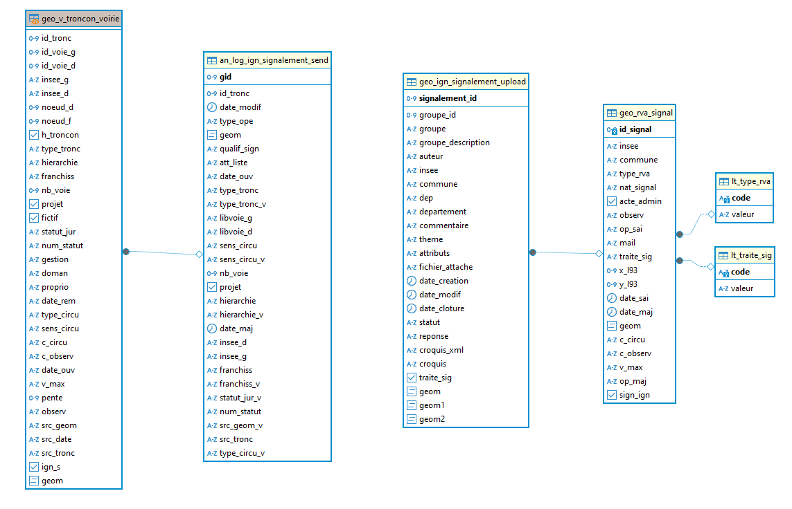
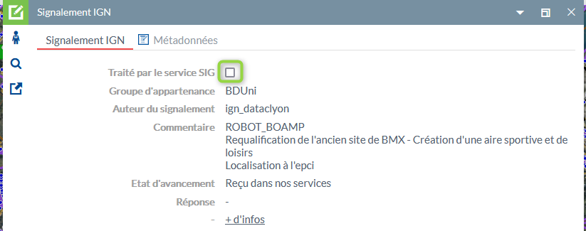
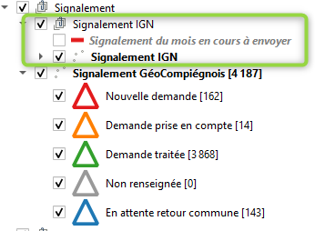
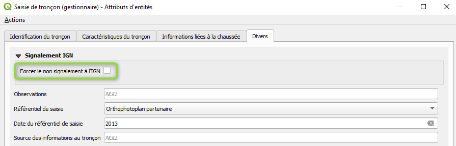

# Documentation d'administration des signalements sur la thématique Route de la BDTopo l'IGN

## Principes
  * **généralité** :
Afin d'améliorer la remontée des informations gérées dans la base de voies locales à l'ensemble des producteurs de cartographies en ligne, GPS, ... il s'est avéré nécessaire d'alimenter la base Route de la BDTopo de l'IGN qui est généralement utilisé par ces producteurs. Une expertise de l'IGN a été menée sur notre base de voies avant d'entamer une démarche de signalements. Celle-ci a été mise en place à l'issue.
 
 * **résumé fonctionnel** :
L'objectif n'est pas de créér des signalements "manuels" comme pour les adresses, mais de les générer de façon automatique. Cette génération nous oblige à mettre en place un fonctionnel permettant d'isoler les modifications réalisées et celles devant être envoyées à l'IGN. L'ensemble de ces contraintes sont gérées en 2 temps. Un permier temps isole l'ensemble des traces dans une table spécifique alimentée par la vue de gestion des tronçons de voies. Le second temps consiste à réaliser un post-traitement dans FME afin de préparer les données à envoyer à l'IGN. En effet l'IGN a développé un transformer pour envoyer les signalements.

## Schéma fonctionnel

## Modèle conceptuel simplifié

## Dépendances

L'écriture des traces, ensemble des modifications effectuées sur la base de voies, est réalisée à partir de la vue de gestion des tronçons de voies. Cette vue est stockée dans le schéma `m_voirie` et se nomme `geo_v_troncon_voirie`. Elle est accessible et modifiable dans le projet QGIS de gestion.

Sur cette vue a été intégrée un trigger pour générer les traces.

* 1 trigger :
  * `t_t4_sign_ign` : à l'insertion, mise à jour ou suppression

Cette fonction permet d'écrire l'ensemble des traces selon les paramètres définis avec l'IGN. En effet, toutes les modifications réalisées sur la base de voies ne doivent pas être envoyées à l'IGN. Ci-dessous, la liste des critères d'envois (donc d'écriture d'une trace).

- quand je supprime un tronçon (pour les statuts hors département, national, autoroute)
- quand j'insère un tronçon (pour les statuts hors département, national, autoroute)
- à la mise à jour d'un tronçon (géométrie ou attribut) et toujours pour les statuts hors département, national, autoroute :
 - en géométrie : filtre sur les ajustements de tracés inférieurs à 6m non pris en compte
 - attribut : filtre uniquement sur les modifications des attributs suivants (`date_ouv`, `type_tronc`, `id_voie`,`sens_circu`,`nb_voie`,`projet`,`statut_jur`,`num_statut`)

Concernant l'attribut franchissements, celui-ci est envoyé si il correspond à un passage à niveau ou un pont.

Le fonctionnel mis en place à travers un workflow FME (envoi mensuel pour rappel), permet de post-traiter l'ensemble des traces du mois enregistrés. Se référer à la partie des traitements FME (ci-après) pour plus de précisions.

## Classes d'objets

L'ensemble des classes d'objets de gestion sont stockés dans le schéma `m_signalement`.

 ### classes d'objets de gestion :
  
   `m_signalement.an_log_ign_signalement_send` : table des traces (modification) effectuées sur la base de voies
   
|Nom attribut | Définition | Type | Valeurs par défaut |
|:---|:---|:---|:---|
|gid|Identifiant unique de chaque changement intervenu sur un tronçon|bigint|nextval('m_signalement.an_log_ign_signalement_send_gid_seq'::regclass)|
|id_tronc|identifiant du tronçon|bigint| |
|date_modif|Date du changement effectué en base|timestamp without time zone| |
|type_ope|Type d'opération effectuée|text| |
|geom|Géométrie du tronçon à envoyer avec le signalement|linestring(2154)| |
|qualif_sign|Qualification du signalement, sera envoyé comme description|text| |
|att_liste|Liste des attributs ayant subi une modification de sa valeur|text| |
|date_ouv|Valeur de la date d'ouverture envoyée avec le signalement|character varying(4)| |
|type_tronc|Code du type de tronçon envoyée avec le signalement|character varying(2)| |
|type_tronc_v|Valeur du type de tronçon envoyée avec le signalement|text| |
|libvoie_g|Libellé de voie gauche envoyée avec le signalement|text| |
|libvoie_d|Libellé de voie droite envoyée avec le signalement|text| |
|sens_circu|Code du sens de circulation envoyée avec le signalement|character varying(2)| |
|sens_circu_v|Valeur du sens de circulation envoyée avec le signalement|text| |
|nb_voie|Nombre de voie envoyée avec le signalement|smallint| |
|projet|Information du tronçon en projet ou non envoyée avec le signalement|boolean| |
|hierarchie|Code de hiérarchie envoyée avec le signalement|character varying(1)| |
|hierarchie_v|Valeur de la hiérarchie du tronçon envoyée avec le signalement|text| |
|date_maj|Date de saisie ou de mise à jour du tronçon envoyée avec le signalement|timestamp without time zone| |
|insee_d|Code insee droite envoyée avec le signalement|character varying(5)| |
|insee_g|Code insee gaiche envoyée avec le signalement|character varying(5)| |
|franchiss|Code de franchissement envoyée avec le signalement|character varying(2)| |
|franchiss_v|Valeur du code de franchissement envoyée avec le signalement|text| |
|statut_jur_v|Valeur du statut juridique envoyée avec le signalement|text| |
|num_statut|Numéro de statut de la voie envoyée avec le signalement|character varying(10)| |
|src_geom_v|Valeur du référentiel géographique utilisé pour la saisie envoyée avec le signalement|text| |
|src_tronc|Valeur de la source d'information à l'origine du tracé envoyée avec le signalement|text| |
|type_circu_v|Valeur du type de circulation envoyée avec le signalement|text| |

Particularité(s) à noter :
* Une clé primaire existe sur le champ `gid` lui-même contenant une séquence pour l'attribution automatique d'une référence de trace. 
* 1 trigger :
  * `t_t0_sign_ign_after` : après l'insertion, cette fonction permet de traiter le cas des découpes de tronçons propre à la gestion de voies. Cette modification ne doit pas remonter à l'IGN. Dans un processus automatique, cette découpe génére un `update` sur une partie du tronçon découpé et créer un tronçon sur l'autre partie. Le processus de trace depuis la vue de gestion enregistre bien ces 2 mouvements mais la fonction-trigger les supprime après l'enregistrement. Cette pratique implique d'enregistrer le découpage avant d'effectuer éventuellement une autre modification qui elle ne serait pas prise en compte.

---

 `m_signalement.geo_ign_signalement_upload` : table de l'ensemble des signalements réalisés auprès de l'IGN (à l'exception de ceux générés par GéoCompiégnois)
   
|Nom attribut | Définition | Type | Valeurs par défaut |
|:---|:---|:---|:---|
|groupe_id|Identifiant du groupe de l'espace collaboratif|smallint| |
|groupe|Groupe d'appartenance|text| |
|groupe_description|Description du groupe d'appartenance|text| |
|auteur|Auteur du signalement|text| |
|commune|Libellé de la commune|text| |
|departement|Département|text| |
|commentaire|Commentaire de la personne ayant fait le signalement|text| |
|theme|Thème du signalement (ici ROUTE)|text| |
|attributs|sans objet|text| |
|fichier_attache|Fichier lié|text| |
|date_creation|Date de création du signelement|date| |
|date_modif|Date de modification du signalement|date| |
|date_cloture|Date de cloture du signalement|date| |
|reponse|Réponse au signalement|text| |
|croquis_xml|Contenue du croquis au format XML|text| |
|croquis|Contenu json du croquis|text| |
|traite_sig|Information du traitement du signalement par le service SIG|boolean|false|
|geom|Géométrie du signalement (point)|point(2154)| |
|geom1|Géométrie du croquis (ligne)|multilinestring(2154)| |
|geom2|Géométrie du croquis (point)|multipoint(2154)| |

Particularité(s) à noter :
* Une clé primaire existe sur le champ `signalement_id` : identifiant de signalement interne l'IGN (et unique)
* 1 trigger :
  * `t_t1_signal_rva` : avant la mise à jour sur l'attribut `traite_sig`. Cette fonction permet de générer un signalement classique sur la base de "voie-adresse" comme traité. Ce signalement est généré dans la classe d'objets `m_signalement.geo_rva_signal`. Celui-ci remonte dans les statistiques internes au service. L'activitation de ce processus est dépendant de l'opérateur de saisie à travers l'application GEO "Voie-Adresse" dans la fiche d'informations des signalements IGN.
 

### classes d'objets applicatives métiers sont classés dans le schéma x_apps :
 
Sans objet

### classes d'objets applicatives grands publics sont classés dans le schéma x_apps_public :

Sans objet

### classes d'objets opendata sont classés dans le schéma x_opendata :

Sans objet

## Liste de valeurs

Sans objet

## Traitement automatisé mis en place (Workflow de l'ETL FME)

### Récupération des signalements de la base Route de l'IGN

* `voie_ign_api_signalement_upload.fmw` : ce traitement permet de récupérer l'ensemble des signalements fait à l'IGN sur la base Route (hors ceux réalisés par GeoCompiégnois). Ces signalements sont stockés dans la table `m_signalement.geo_ign_signalement_upload`. Ces informations sont affichées dans le projet QGIS et dans l'application "Voie-Adresse".

Ce traitement a été automatisé dans FME-Flow et s'éxécute tous les jours.

### Envoie des signalements à la base Route de l'IGN

* `voie_ign_api_signalement_send.fmw` : post-traitement FME des traces enregistrées dans le mois. Une synthèse est réalisée sur l'ensemble des traces d'un même tronçon (pour éviter des envois multiples)
   - filtre sur les tronçons supprimés inférieurs à 25m
   - un delete, un insert ou un update unique par tronçon n'est pas filtré. Un paramétrage particulier est réalisé pour ajouter la liste des attributs éventuellement modifiés à la description du signalement
   - un insert / delete d'un même tronçon n'est pas envoyé
   - un insert / update est post-traité pour indiquer qu'il s'agit d'un INSERT avec les attributs modifiés de l'UPDATE
   - un update multiple est post-traité pour déterminer si il s'agit d'une mise à jour géométrique, attributaire ou les deux

 Une fois ce post-traitement réalisé, les signalements sont envoyés à l'IGN, et en retour, le transformer renvoie un n° de signalement IGN qui est écrit dans un fichier Excel de suivi `voie_ign_api_signalement_send_trace_id.xlsx`. Un email est également générer au service pour confirmer l'envoie. Si un problème survient pendant le post-traitement, un `Terminator` a été intégré avec l'envoi d'un email au service indiquant le problème rencontré.

Ce post-traitement a été automatisé dans FME-Flow et s'éxécute chaque 1er jour du mois et traite les traces du mosi précédent. Les traces du mois en cours sont également affichées dans le projet QGIS.

## Projet QGIS pour la gestion

Le projet QGIS utilisé est celui de la gestion de la base de voie. Il est stocké ici :
R:\Ressources\4-Partage\3-Procedures\QGIS\RVA_3.x.qgs

Dans ce projet, sont visibles les signalements uploadés de l'IGN et ceux du mois en cours qui seront envoyés le 1er jour du mois suivant.

Il est possible de forcer un non-signalement à l'IGN, à savoir ne pas générer une trace depuis ce projet si un besoin particulier de modification de la base de voies est nécessaire. Il suffit de cocher la case présente dans l'ongler `Divers` de la fiche du tronçon.

## Export Open Data

Sans objet

---

